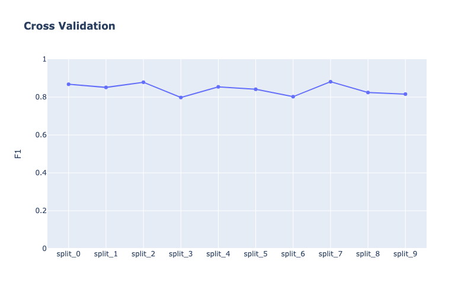

# {{page.title}}
{: .no_toc}

<details open markdown="block">
  <summary>
    Table of contents
  </summary>
  {: .text-delta }
- TOC
{:toc}
</details>

<hr>

# cross_validation_analysis()
{: .mb-6}


It evaluates the model performances for different subsets of the data set.


#### Parameters
{: .no_toc}
<dl>
  

  <dt><strong>{{ param.name }}</strong></dt>
  <dd><br><b><i>{{ param.type }}</i></b></dd><dd>{{ param.description }}</dd>

  
</dl>

<hr>

### Example
{: .no_toc}
#### Classification
{: .no_toc}
```py
from odin.classes import AnalyzerClassification

my_analyzer = AnalyzerClassification("my_classifier_name", my_classification_dataset)
my_analyzer.cross_validation_analysis()
```

#### Localization
{: .no_toc}
```py
from odin.classes import AnalyzerLocalization

my_analyzer = AnalyzerLocalization("my_detector_name", my_localization_dataset)
my_analyzer.cross_validation_analysis()
```

{:class="img-responsive" style="max-width:800px"}
{: .text-center}

<hr>

### Tasks supported
{: .no_toc}
<table>
  <thead>
    <tr class="header">
      <th>Binary Classification</th>
      <th>Single-label Classification</th>
      <th>Multi-label Classification</th>
      <th>Object Detection</th>
      <th>Instance Segmentation</th>
    </tr>
  </thead>
  <tbody>
    <tr style="text-align:center;">
      <td style="background:lightgreen;">yes</td>
      <td style="background:lightgreen;">yes</td>
      <td style="background:lightgreen;">yes</td>
      <td style="background:lightgreen;">yes</td>
      <td style="background:lightgreen;">yes</td>
    </tr>
  </tbody>
</table>
