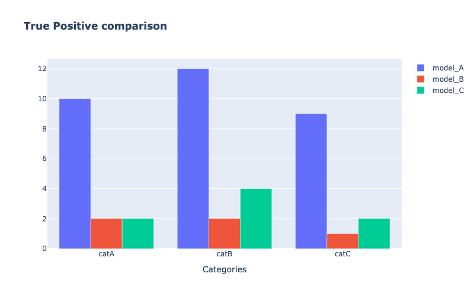
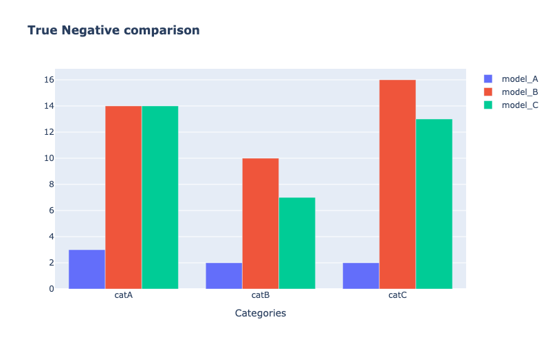

# {{page.title}}
{: .no_toc}

<details open markdown="block">
  <summary>
    Table of contents
  </summary>
  {: .text-delta }
- TOC
{:toc}
</details>

<hr>

# show_confusion_matrix()
{: .mb-6}

It shows the confusion matrix of the model. The confusion matrix can be performed for the entire data set or for a subset with a specific property value.

#### Parameters
{: .no_toc}
<dl>
  

  <dt><strong>{{ param.name }}</strong></dt>
  <dd><br><b><i>{{ param.type }}</i></b></dd><dd>{{ param.description }}</dd>

  
</dl>

<hr>

### Example
{: .no_toc}
#### Classification
{: .no_toc}
```py
from odin.classes import AnalyzerClassification

my_analyzer = AnalyzerClassification("my_classifier_name", my_classification_dataset)
my_analyzer.show_confusion_matrix()
```

{:class="img-responsive" width="60%"}
{: .text-center}

<p style="font-size: 10px; text-align: right;">N.B. As example, it is shown only the output of a single category, but the analysis is performed for all the categories selected.</p>

{:class="img-responsive" width="75%"}
{: .text-center}

N.B. The confusion matrix among the categories is supported only for single-label classification task.
{: .text-right .fs-1}

<hr>

### Tasks supported
{: .no_toc}
<table>
  <thead>
    <tr class="header">
      <th>Binary Classification</th>
      <th>Single-label Classification</th>
      <th>Multi-label Classification</th>
      <th>Object Detection</th>
      <th>Instance Segmentation</th>
    </tr>
  </thead>
  <tbody>
    <tr style="text-align:center;">
      <td style="background:lightgreen;">yes</td>
      <td style="background:lightgreen;">yes</td>
      <td style="background:lightgreen;">yes</td>
      <td style="background:lightcoral;">no</td>
      <td style="background:lightcoral;">no</td>
    </tr>
  </tbody>
</table>

<hr>

# show_true_positive_distribution()
{: .mb-6}

It provides the true positive distribution among the categories.

#### Parameters
{: .no_toc}
<dl>
  

  <dt><strong>{{ param.name }}</strong></dt>
  <dd><br><b><i>{{ param.type }}</i></b></dd><dd>{{ param.description }}</dd>

  
</dl>

<hr>

### Example
{: .no_toc}
#### Classification
{: .no_toc}
```py
from odin.classes import AnalyzerClassification

my_analyzer = AnalyzerClassification("my_classifier_name", my_classification_dataset)
my_analyzer.show_true_positive_distribution()
```
#### Localization
{: .no_toc}
```py
from odin.classes import AnalyzerLocalization

my_analyzer = AnalyzerLocalization("my_detector_name", my_localization_dataset)
my_analyzer.show_true_positive_distribution()
```

{:class="img-responsive" width="75%"}
{: .text-center}

<hr>

## Models comparison
### Example
{: .no_toc}

#### Classification
{: .no_toc}
```py
from odin.classes import ComparatorClassification

my_comparator = ComparatorClassification(dataset_gt_param, classification_type, models_proposals)
my_comparator.compare_models_on_true_positive()
```

#### Localization
{: .no_toc}
```py
from odin.classes import ComparatorLocalization

my_comparator = ComparatorLocalization(dataset_gt_param, task_type, models_proposals)
my_comparator.compare_models_on_true_positive()
```

{:class="img-responsive" width="75%"}
{: .text-center}

<hr>

### Tasks supported
{: .no_toc}
<table>
  <thead>
    <tr class="header">
      <th>Binary Classification</th>
      <th>Single-label Classification</th>
      <th>Multi-label Classification</th>
      <th>Object Detection</th>
      <th>Instance Segmentation</th>
    </tr>
  </thead>
  <tbody>
    <tr style="text-align:center;">
      <td style="background:lightcoral;">no</td>
      <td style="background:lightgreen;">yes</td>
      <td style="background:lightgreen;">yes</td>
      <td style="background:lightgreen;">yes</td>
      <td style="background:lightgreen;">yes</td>
    </tr>
  </tbody>
</table>

<hr>

# show_false_positive_distribution()
{: .mb-6}

It provides the false positive distribution among the categories.

#### Parameters
{: .no_toc}
<dl>
  

  <dt><strong>{{ param.name }}</strong></dt>
  <dd><br><b><i>{{ param.type }}</i></b></dd><dd>{{ param.description }}</dd>

  
</dl>

<hr>

### Example
{: .no_toc}
#### Classification
{: .no_toc}
```py
from odin.classes import AnalyzerClassification

my_analyzer = AnalyzerClassification("my_classifier_name", my_classification_dataset)
my_analyzer.show_false_positive_distribution()
```
#### Localization
{: .no_toc}
```py
from odin.classes import AnalyzerLocalization

my_analyzer = AnalyzerLocalization("my_detector_name", my_localization_dataset)
my_analyzer.show_false_positive_distribution()
```

{:class="img-responsive" width="75%"}
{: .text-center}

<hr>

## Models comparison
### Example
{: .no_toc}

#### Classification
{: .no_toc}
```py
from odin.classes import ComparatorClassification

my_comparator = ComparatorClassification(dataset_gt_param, classification_type, models_proposals)
my_comparator.compare_models_on_false_positive()
```

#### Localization
{: .no_toc}
```py
from odin.classes import ComparatorLocalization

my_comparator = ComparatorLocalization(dataset_gt_param, task_type, models_proposals)
my_comparator.compare_models_on_false_positive()
```

{:class="img-responsive" width="75%"}
{: .text-center}

<hr>

### Tasks supported
{: .no_toc}
<table>
  <thead>
    <tr class="header">
      <th>Binary Classification</th>
      <th>Single-label Classification</th>
      <th>Multi-label Classification</th>
      <th>Object Detection</th>
      <th>Instance Segmentation</th>
    </tr>
  </thead>
  <tbody>
    <tr style="text-align:center;">
      <td style="background:lightcoral;">no</td>
      <td style="background:lightgreen;">yes</td>
      <td style="background:lightgreen;">yes</td>
      <td style="background:lightgreen;">yes</td>
      <td style="background:lightgreen;">yes</td>
    </tr>
  </tbody>
</table>

<hr>

# show_false_negative_distribution()
{: .mb-6}

It provides the false negative distribution among the categories.


#### Parameters
{: .no_toc}
<dl>
  

  <dt><strong>{{ param.name }}</strong></dt>
  <dd><br><b><i>{{ param.type }}</i></b></dd><dd>{{ param.description }}</dd>

  
</dl>

<hr>

### Example
{: .no_toc}
#### Classification
{: .no_toc}
```py
from odin.classes import AnalyzerClassification

my_analyzer = AnalyzerClassification("my_classifier_name", my_classification_dataset)
my_analyzer.show_false_negative_distribution()
```
#### Localization
{: .no_toc}
```py
from odin.classes import AnalyzerLocalization

my_analyzer = AnalyzerLocalization("my_detector_name", my_localization_dataset)
my_analyzer.show_false_negative_distribution()
```

{:class="img-responsive" width="75%"}
{: .text-center}

<hr>

## Models comparison
### Example
{: .no_toc}

#### Classification
{: .no_toc}
```py
from odin.classes import ComparatorClassification

my_comparator = ComparatorClassification(dataset_gt_param, classification_type, models_proposals)
my_comparator.compare_models_on_false_negative()
```

#### Localization
{: .no_toc}
```py
from odin.classes import ComparatorLocalization

my_comparator = ComparatorLocalization(dataset_gt_param, task_type, models_proposals)
my_comparator.compare_models_on_false_negative()
```

{:class="img-responsive" width="75%"}
{: .text-center}

<hr>

### Tasks supported
{: .no_toc}
<table>
  <thead>
    <tr class="header">
      <th>Binary Classification</th>
      <th>Single-label Classification</th>
      <th>Multi-label Classification</th>
      <th>Object Detection</th>
      <th>Instance Segmentation</th>
    </tr>
  </thead>
  <tbody>
    <tr style="text-align:center;">
      <td style="background:lightcoral;">no</td>
      <td style="background:lightgreen;">yes</td>
      <td style="background:lightgreen;">yes</td>
      <td style="background:lightgreen;">yes</td>
      <td style="background:lightgreen;">yes</td>
    </tr>
  </tbody>
</table>

<hr>

# show_true_negative_distribution()
{: .mb-6}

It provides the true negative distribution among the categories.

#### Parameters
{: .no_toc}
<dl>
  

  <dt><strong>{{ param.name }}</strong></dt>
  <dd><br><b><i>{{ param.type }}</i></b></dd><dd>{{ param.description }}</dd>

  
</dl>

<hr>

### Example
{: .no_toc}
#### Classification
{: .no_toc}
```py
from odin.classes import AnalyzerClassification

my_analyzer = AnalyzerClassification("my_classifier_name", my_classification_dataset)
my_analyzer.show_true_negative_distribution()
```

{:class="img-responsive" width="75%"}
{: .text-center}

<hr>

## Models comparison
### Example
{: .no_toc}

#### Classification
{: .no_toc}
```py
from odin.classes import ComparatorClassification

my_comparator = ComparatorClassification(dataset_gt_param, classification_type, models_proposals)
my_comparator.compare_models_on_true_negative()
```

{:class="img-responsive" width="75%"}
{: .text-center}

<hr>

### Tasks supported
{: .no_toc}
<table>
  <thead>
    <tr class="header">
      <th>Binary Classification</th>
      <th>Single-label Classification</th>
      <th>Multi-label Classification</th>
      <th>Object Detection</th>
      <th>Instance Segmentation</th>
    </tr>
  </thead>
  <tbody>
    <tr style="text-align:center;">
      <td style="background:lightcoral;">no</td>
      <td style="background:lightgreen;">yes</td>
      <td style="background:lightgreen;">yes</td>
      <td style="background:lightcoral;">no</td>
      <td style="background:lightcoral;">no</td>
    </tr>
  </tbody>
</table>
