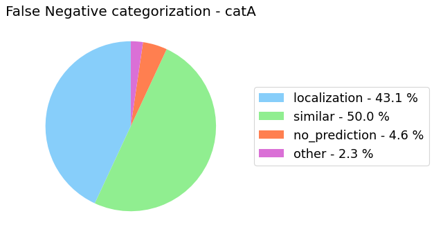

# {{page.title}}
{: .no_toc}

<details open markdown="block">
  <summary>
    Table of contents
  </summary>
  {: .text-delta }
- TOC
{:toc}
</details>

<hr>

# analyze_false_positive_errors_for_category()
{: .mb-6}

It analyzes the false positives for a specific category, by identifying the type of the errors and shows the gain that the model could achieve by removing all the false positives of each type.

For classification tasks we have categorized the False Positive into three different types:
- **_Background_**: the observation does not represent any of the categories (only for multi-label classification task).
- **_Similar_**: the observation represents a similar category to the predicted one.
- **_Other_**: all the other cases.

For localization tasks we have identified four different errors:
- **_Background_**: the category predicted has been confused with the background or the IoU with the corresponding annotation is less than a minimum threshold (set to 0.2).
- **_Localization_**: the model has correctly predicted the category but the IoU with the corresponding annotation is less than the threshold.
- **_Similar_**: the ground truth annotation represents a similar category to the predicted one and the IoU is equal or greater than the threshold.
- **_Other_**: all the other cases.

#### Parameters
{: .no_toc}
<dl>
  

  <dt><strong>{{ param.name }}</strong></dt>
  <dd><br><b><i>{{ param.type }}</i></b></dd><dd>{{ param.description }}</dd>

  
</dl>

<hr>

### Example
{: .no_toc}
#### Classification
{: .no_toc}
```py
from odin.classes import AnalyzerClassification

my_analyzer = AnalyzerClassification("my_classifier_name", my_classification_dataset)
my_analyzer.analyze_false_positive_errors_for_category('catA')
```

{:class="img-responsive" style="max-width:600px"}
{:class="img-responsive" style="max-width:600px"}
{: .text-center}

#### Localization
{: .no_toc}
```py
from odin.classes import AnalyzerLocalization

my_analyzer = AnalyzerLocalization("my_detector_name", my_localization_dataset)
my_analyzer.analyze_false_positive_errors_for_category('catA')
```

{:class="img-responsive" style="max-width:600px"}
{:class="img-responsive" style="max-width:600px"}
{: .text-center}

<hr>

### Tasks supported
{: .no_toc}
<table>
  <thead>
    <tr class="header">
      <th>Binary Classification</th>
      <th>Single-label Classification</th>
      <th>Multi-label Classification</th>
      <th>Object Detection</th>
      <th>Instance Segmentation</th>
    </tr>
  </thead>
  <tbody>
    <tr style="text-align:center;">
      <td style="background:lightcoral;">no</td>
      <td style="background:lightgreen;">yes</td>
      <td style="background:lightgreen;">yes</td>
      <td style="background:lightgreen;">yes</td>
      <td style="background:lightgreen;">yes</td>
    </tr>
  </tbody>
</table>

<hr>

# analyze_false_positive_errors()
For each class, it analyzes the false positives by identifying the type of the errors and shows the gain that the model could achieve by removing all the false positives of each type.

#### Parameters
{: .no_toc}
<dl>
  

  <dt><strong>{{ param.name }}</strong></dt>
  <dd><br><b><i>{{ param.type }}</i></b></dd><dd>{{ param.description }}</dd>

  
</dl>

<hr>

### Example
{: .no_toc}
#### Classification
{: .no_toc}
```py
from odin.classes import AnalyzerClassification

my_analyzer = AnalyzerClassification("my_classifier_name", my_classification_dataset)
my_analyzer.analyze_false_positive_errors()
```
{:class="img-responsive" style="max-width:600px"}
{:class="img-responsive" style="max-width:600px"}
{: .text-center}

<p style="font-size: 10px; text-align: right;">N.B. As example, it is shown only the output of a single category, but the analysis is performed for all the categories selected.</p>

#### Localization
{: .no_toc}
```py
from odin.classes import AnalyzerLocalization

my_analyzer = AnalyzerLocalization("my_detector_name", my_localization_dataset)
my_analyzer.analyze_false_positive_errors()

```

{:class="img-responsive" style="max-width:600px"}
{:class="img-responsive" style="max-width:600px"}
{: .text-center}

N.B. As example, it is shown only the output of a single category, but the analysis is performed for all the categories selected.
{: .text-right .fs-1}

<hr>

## Models comparison

### Example
{: .no_toc}

#### Classification
{: .no_toc}
```py
from odin.classes import ComparatorClassification

similar_categories = [[1, 3], [2, 3]]

my_comparator = ComparatorClassification(dataset_gt_param, classification_type, models_proposals, similar_classes=similar_categories)
my_comparator.analyze_false_positive_errors()
```

#### Localization
{: .no_toc}
```py
from odin.classes import ComparatorLocalization

my_comparator = ComparatorLocalization(dataset_gt_param, task_type, models_proposals, similar_classes=similar_categories)
my_comparator.analyze_false_positive_errors()
```

{:class="img-responsive" style="max-width:800px"}
{:class="img-responsive" style="max-width:800px"}
{:class="img-responsive" style="max-width:800px"}
{: .text-center}

<hr>

### Tasks supported
{: .no_toc}
<table>
  <thead>
    <tr class="header">
      <th>Binary Classification</th>
      <th>Single-label Classification</th>
      <th>Multi-label Classification</th>
      <th>Object Detection</th>
      <th>Instance Segmentation</th>
    </tr>
  </thead>
  <tbody>
    <tr style="text-align:center;">
      <td style="background:lightcoral;">no</td>
      <td style="background:lightgreen;">yes</td>
      <td style="background:lightgreen;">yes</td>
      <td style="background:lightgreen;">yes</td>
      <td style="background:lightgreen;">yes</td>
    </tr>
  </tbody>
</table>

# analyze_false_positive_trend_for_category()
{: .mb-6}

It analyzes the trend of the false positives by indicating the percentage of each error type.

#### Parameters
{: .no_toc}
<dl>
  

  <dt><strong>{{ param.name }}</strong></dt>
  <dd><br><b><i>{{ param.type }}</i></b></dd><dd>{{ param.description }}</dd>

  
</dl>

<hr>

### Example
{: .no_toc}
#### Classification
{: .no_toc}
```py
from odin.classes import AnalyzerClassification

my_analyzer = AnalyzerClassification("my_classifier_name", my_classification_dataset)
my_analyzer.analyze_false_positive_trend_for_category('catA')
```

{:class="img-responsive" style="max-width:800px"}
{: .text-center}

#### Localization
{: .no_toc}
```py
from odin.classes import AnalyzerLocalization

my_analyzer = AnalyzerLocalization("my_detector_name", my_localization_dataset)
my_analyzer.analyze_false_positive_trend_for_category('catA')
```

{:class="img-responsive" style="max-width:800px"}
{: .text-center}

<hr>

### Tasks supported
{: .no_toc}
<table>
  <thead>
    <tr class="header">
      <th>Binary Classification</th>
      <th>Single-label Classification</th>
      <th>Multi-label Classification</th>
      <th>Object Detection</th>
      <th>Instance Segmentation</th>
    </tr>
  </thead>
  <tbody>
    <tr style="text-align:center;">
      <td style="background:lightcoral;">no</td>
      <td style="background:lightgreen;">yes</td>
      <td style="background:lightgreen;">yes</td>
      <td style="background:lightgreen;">yes</td>
      <td style="background:lightgreen;">yes</td>
    </tr>
  </tbody>
</table>

<hr>

# analyze_false_positive_trend()
{: .mb-6}

For each class, it analyzes the trend of the false positives by indicating the percentage of each error type.

#### Parameters
{: .no_toc}
<dl>
  

  <dt><strong>{{ param.name }}</strong></dt>
  <dd><br><b><i>{{ param.type }}</i></b></dd><dd>{{ param.description }}</dd>

  
</dl>

<hr>

### Example
{: .no_toc}
#### Classification
{: .no_toc}
```py
from odin.classes import AnalyzerClassification

my_analyzer = AnalyzerClassification("my_classifier_name", my_classification_dataset)
my_analyzer.analyze_false_positive_trend()
```

{:class="img-responsive" style="max-width:800px"}
{: .text-center}

N.B. As example, it is shown only the output of a single category, but the analysis is performed for all the categories selected.
{: .text-right .fs-1}

#### Localization
{: .no_toc}
```py
from odin.classes import AnalyzerLocalization

my_analyzer = AnalyzerLocalization("my_detector_name", my_localization_dataset)
my_analyzer.analyze_false_positive_trend()
```

{:class="img-responsive" style="max-width:800px"}
{: .text-center}

N.B. As example, it is shown only the output of a single category, but the analysis is performed for all the categories selected.
{: .text-right .fs-1}

<hr>

### Tasks supported
{: .no_toc}
<table>
  <thead>
    <tr class="header">
      <th>Binary Classification</th>
      <th>Single-label Classification</th>
      <th>Multi-label Classification</th>
      <th>Object Detection</th>
      <th>Instance Segmentation</th>
    </tr>
  </thead>
  <tbody>
    <tr style="text-align:center;">
      <td style="background:lightcoral;">no</td>
      <td style="background:lightgreen;">yes</td>
      <td style="background:lightgreen;">yes</td>
      <td style="background:lightgreen;">yes</td>
      <td style="background:lightgreen;">yes</td>
    </tr>
  </tbody>
</table>

<hr>

# analyze_false_negative_errors_for_category()
{: .mb-6}

It analyzes the false negatives for a specific category, by identifying the type of the errors.

For classification tasks we have categorized the false negative into two different types:
- **_Similar_**: the model has wrongly predicted a class which is similar to the one represented in the observation.
- **_Other_**: all the other cases.

For localization tasks we have identified four different errors:
- **_Localization_**: the model has correctly predicted the category but the IoU with the corresponding annotation is less than the threshold but equal or greater than a minimum threshold (set to 0.2).
- **_Similar_**: the ground truth annotation represents a similar category to the predicted one and the IoU is equal or greater than the threshold.
- **_No_prediction_**: the ground truth annotation does not have a corresponding prediction or the IoU is less than a minimum threshold (set to 0.2).
- **_Other_**: all the other cases.

#### Parameters
{: .no_toc}
<dl>
  

  <dt><strong>{{ param.name }}</strong></dt>
  <dd><br><b><i>{{ param.type }}</i></b></dd><dd>{{ param.description }}</dd>

  
</dl>

<hr>

### Example
{: .no_toc}
#### Classification
{: .no_toc}
```py
from odin.classes import AnalyzerClassification

my_analyzer = AnalyzerClassification("my_classifier_name", my_classification_dataset)
my_analyzer.analyze_false_negative_errors_for_category('catA')
```

{:class="img-responsive" style="max-width:600px"}
{: .text-center}

#### Localization
{: .no_toc}
```py
from odin.classes import AnalyzerLocalization

my_analyzer = AnalyzerLocalization("my_detector_name", my_localization_dataset)
my_analyzer.analyze_false_negative_errors_for_category('catA')
```

{:class="img-responsive" style="max-width:600px"}
{: .text-center}

<hr>

### Tasks supported
{: .no_toc}
<table>
  <thead>
    <tr class="header">
      <th>Binary Classification</th>
      <th>Single-label Classification</th>
      <th>Multi-label Classification</th>
      <th>Object Detection</th>
      <th>Instance Segmentation</th>
    </tr>
  </thead>
  <tbody>
    <tr style="text-align:center;">
      <td style="background:lightcoral;">no</td>
      <td style="background:lightgreen;">yes</td>
      <td style="background:lightgreen;">yes</td>
      <td style="background:lightgreen;">yes</td>
      <td style="background:lightgreen;">yes</td>
    </tr>
  </tbody>
</table>

<hr>

# analyze_false_negative_errors()
For each class, it analyzes the false negatives by identifying the type of the errors.

#### Parameters
{: .no_toc}
<dl>
  

  <dt><strong>{{ param.name }}</strong></dt>
  <dd><br><b><i>{{ param.type }}</i></b></dd><dd>{{ param.description }}</dd>

  
</dl>

<hr>

### Example
{: .no_toc}
#### Classification
{: .no_toc}
```py
from odin.classes import AnalyzerClassification

my_analyzer = AnalyzerClassification("my_classifier_name", my_classification_dataset)
my_analyzer.analyze_false_negative_errors()
```
{:class="img-responsive" style="max-width:600px"}
{: .text-center}

<p style="font-size: 10px; text-align: right;">N.B. As example, it is shown only the output of a single category, but the analysis is performed for all the categories selected.</p>

#### Localization
{: .no_toc}
```py
from odin.classes import AnalyzerLocalization

my_analyzer = AnalyzerLocalization("my_detector_name", my_localization_dataset)
my_analyzer.analyze_false_negative_errors()

```

{:class="img-responsive" style="max-width:600px"}
{: .text-center}

N.B. As example, it is shown only the output of a single category, but the analysis is performed for all the categories selected.
{: .text-right .fs-1}

<hr>

## Models comparison

### Example
{: .no_toc}

#### Classification
{: .no_toc}
```py
from odin.classes import ComparatorClassification

similar_categories = [[1, 3], [2, 3]]

my_comparator = ComparatorClassification(dataset_gt_param, classification_type, models_proposals, similar_classes=similar_categories)
my_comparator.analyze_false_negative_errors()
```

#### Localization
{: .no_toc}
```py
from odin.classes import ComparatorLocalization

my_comparator = ComparatorLocalization(dataset_gt_param, task_type, models_proposals, similar_classes=similar_categories)
my_comparator.analyze_false_negative_errors()
```

{:class="img-responsive" style="max-width:800px"}
{:class="img-responsive" style="max-width:800px"}
{:class="img-responsive" style="max-width:800px"}
{: .text-center}

<hr>

### Tasks supported
{: .no_toc}
<table>
  <thead>
    <tr class="header">
      <th>Binary Classification</th>
      <th>Single-label Classification</th>
      <th>Multi-label Classification</th>
      <th>Object Detection</th>
      <th>Instance Segmentation</th>
    </tr>
  </thead>
  <tbody>
    <tr style="text-align:center;">
      <td style="background:lightcoral;">no</td>
      <td style="background:lightgreen;">yes</td>
      <td style="background:lightgreen;">yes</td>
      <td style="background:lightgreen;">yes</td>
      <td style="background:lightgreen;">yes</td>
    </tr>
  </tbody>
</table>
