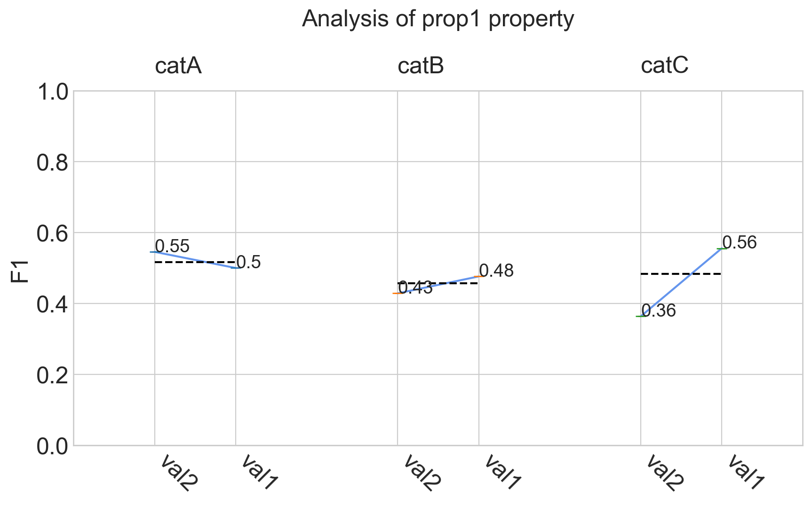
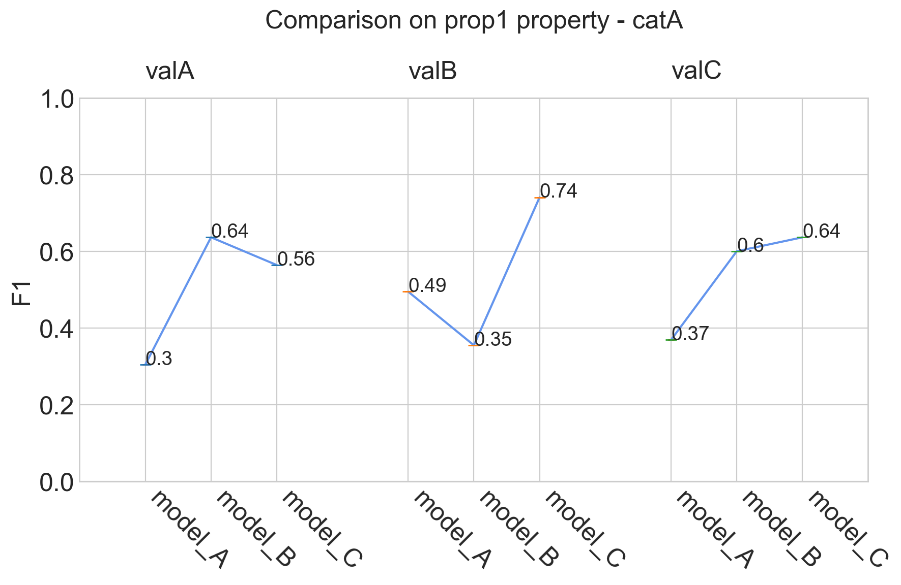
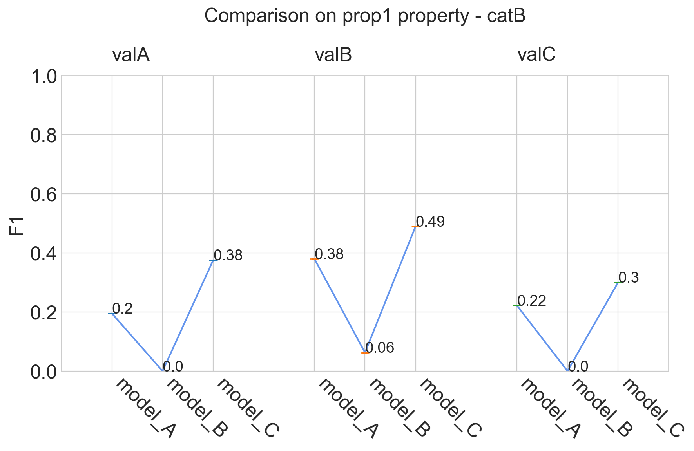
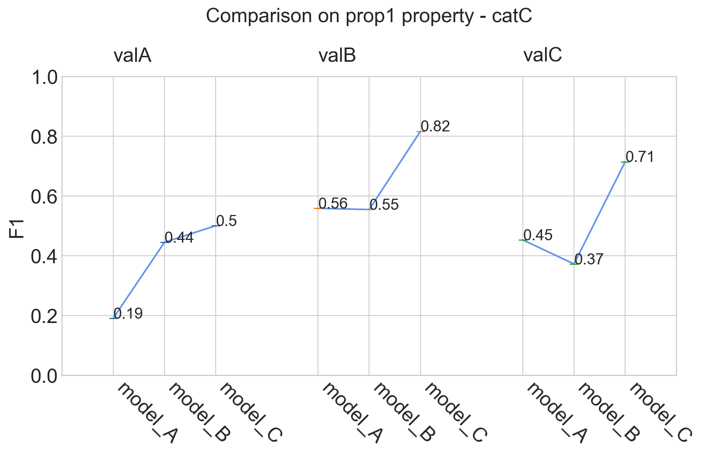
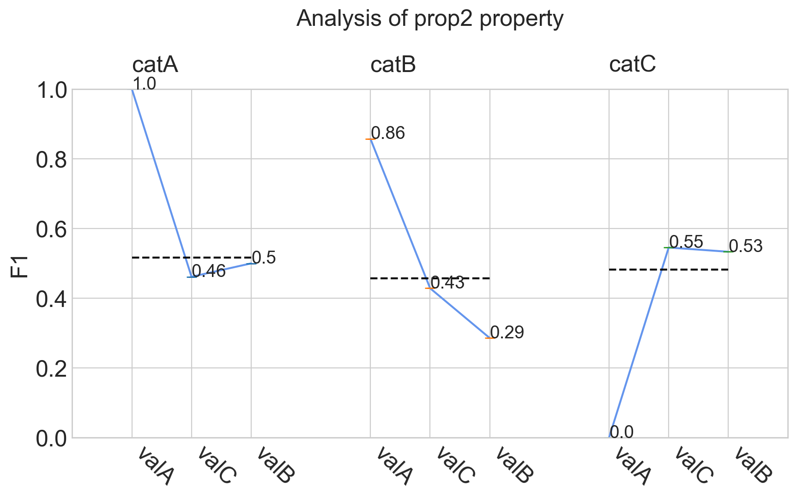
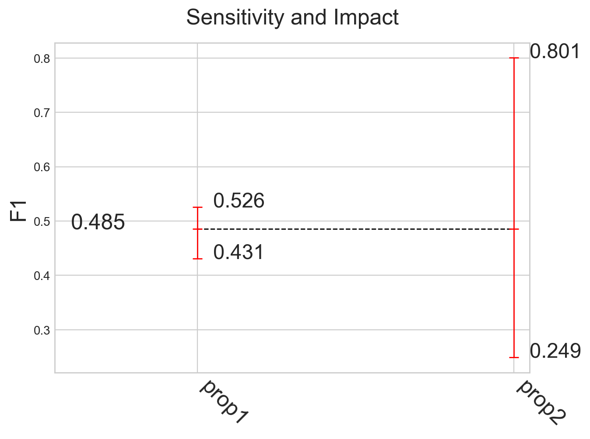
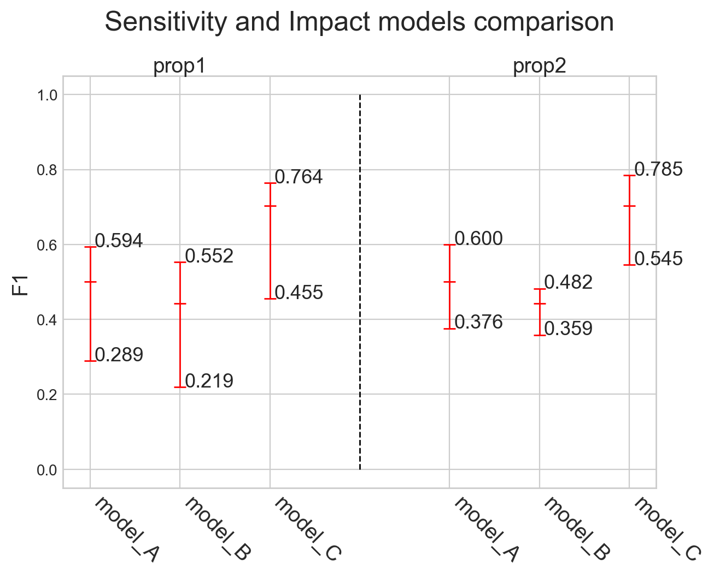

# {{page.title}}
{: .no_toc}

<details open markdown="block">
  <summary>
    Table of contents
  </summary>
  {: .text-delta }
- TOC
{:toc}
</details>

<hr>

# analyze_property()
{: .mb-6}

The model performances are analyzed for each category considering subsets of the data set which have a specific property value.


#### Parameters
{: .no_toc}
<dl>
  

  <dt><strong>{{ param.name }}</strong></dt>
  <dd><br><b><i>{{ param.type }}</i></b></dd><dd>{{ param.description }}</dd>

  
</dl>

<hr>

### Example
{: .no_toc}

#### Classification
{: .no_toc}
```py
from odin.classes import AnalyzerClassification

my_analyzer = AnalyzerClassification("my_classifier_name", my_classification_dataset)
my_analyzer.analyze_property('prop1')
```

#### Localization
{: .no_toc}
```py
from odin.classes import AnalyzerLocalization

my_analyzer = AnalyzerLocalization("my_detector_name", my_localization_dataset)
my_analyzer.analyze_property('prop1')
```

{:class="img-responsive" width="75%"}
{: .text-center}

<hr>

## Models comparison
### Example
{: .no_toc}

#### Classification
{: .no_toc}
```py
from odin.classes import ComparatorClassification

my_comparator = ComparatorClassification(dataset_gt_param, classification_type, models_proposals)
my_comparator.compare_models_on_property('prop1')
```

#### Localization
{: .no_toc}
```py
from odin.classes import ComparatorLocalization

my_comparator = ComparatorLocalization(dataset_gt_param, task_type, models_proposals)
my_comparator.compare_models_on_property('prop1')
```

{:class="img-responsive" width="75%"}
{: .text-center}

{:class="img-responsive" width="75%"}
{: .text-center}

{:class="img-responsive" width="75%"}
{: .text-center}

<hr>

### Tasks supported
{: .no_toc}
<table>
  <thead>
    <tr class="header">
      <th>Binary Classification</th>
      <th>Single-label Classification</th>
      <th>Multi-label Classification</th>
      <th>Object Detection</th>
      <th>Instance Segmentation</th>
    </tr>
  </thead>
  <tbody>
    <tr style="text-align:center;">
      <td style="background:lightgreen;">yes</td>
      <td style="background:lightgreen;">yes</td>
      <td style="background:lightgreen;">yes</td>
      <td style="background:lightgreen;">yes</td>
      <td style="background:lightgreen;">yes</td>
    </tr>
  </tbody>
</table>

<hr>
# analyze_properties()
{: .mb-6}

For each property, the model performances are analyzed for each category considering subsets of the data set which have a specific property value.


#### Parameters
{: .no_toc}
<dl>
  

  <dt><strong>{{ param.name }}</strong></dt>
  <dd><br><b><i>{{ param.type }}</i></b></dd><dd>{{ param.description }}</dd>

  
</dl>

<hr>

### Example
{: .no_toc}

#### Classification
{: .no_toc}
```py
from odin.classes import AnalyzerClassification

my_analyzer = AnalyzerClassification("my_classifier_name", my_classification_dataset)
my_analyzer.analyze_properties()
```

#### Localization
{: .no_toc}
```py
from odin.classes import AnalyzerLocalization

my_analyzer = AnalyzerLocalization("my_detector_name", my_localization_dataset)
my_analyzer.analyze_properties()
```

{:class="img-responsive" width="75%"}
{: .text-center}
{:class="img-responsive" width="75%"}
{: .text-center}

<hr>

### Tasks supported
{: .no_toc}
<table>
  <thead>
    <tr class="header">
      <th>Binary Classification</th>
      <th>Single-label Classification</th>
      <th>Multi-label Classification</th>
      <th>Object Detection</th>
      <th>Instance Segmentation</th>
    </tr>
  </thead>
  <tbody>
    <tr style="text-align:center;">
      <td style="background:lightgreen;">yes</td>
      <td style="background:lightgreen;">yes</td>
      <td style="background:lightgreen;">yes</td>
      <td style="background:lightgreen;">yes</td>
      <td style="background:lightgreen;">yes</td>
    </tr>
  </tbody>
</table>
<hr>
# analyze_sensitivity_impact_of_properties()
{: .mb-6}

It provides the sensitivity of the model for each property and the impact that the latter could have on the overall performance of the model. The sensitivity to a property is the difference between the maximum and minimum score obtained for that meta-annotation. The impact of a property, instead, is the difference between the maximum score achieved for it and the overall score obtained by the model.


#### Parameters
{: .no_toc}
<dl>
  

  <dt><strong>{{ param.name }}</strong></dt>
  <dd><br><b><i>{{ param.type }}</i></b></dd><dd>{{ param.description }}</dd>

  
</dl>

<hr>

### Example
{: .no_toc}

#### Classification
{: .no_toc}
```py
from odin.classes import AnalyzerClassification

my_analyzer = AnalyzerClassification("my_classifier_name", my_classification_dataset)
my_analyzer.analyze_sensitivity_impact_of_properties()
```

#### Localization
{: .no_toc}
```py
from odin.classes import AnalyzerLocalization

my_analyzer = AnalyzerLocalization("my_detector_name", my_localization_dataset)
my_analyzer.analyze_sensitivity_impact_of_properties()
```

{:class="img-responsive" width="75%"}
{: .text-center}

<hr>

## Models comparison
### Example
{: .no_toc}

#### Classification
{: .no_toc}
```py
from odin.classes import ComparatorClassification

my_comparator = ComparatorClassification(dataset_gt_param, classification_type, models_proposals)
my_comparator.compare_models_on_sensitivity_impact()
```

#### Localization
{: .no_toc}
```py
from odin.classes import ComparatorLocalization

my_comparator = ComparatorLocalization(dataset_gt_param, task_type, models_proposals)
my_comparator.compare_models_on_sensitivity_impact()
```

{:class="img-responsive" width="75%"}
{: .text-center}

<hr>

### Tasks supported
{: .no_toc}
<table>
  <thead>
    <tr class="header">
      <th>Binary Classification</th>
      <th>Single-label Classification</th>
      <th>Multi-label Classification</th>
      <th>Object Detection</th>
      <th>Instance Segmentation</th>
    </tr>
  </thead>
  <tbody>
    <tr style="text-align:center;">
      <td style="background:lightgreen;">yes</td>
      <td style="background:lightgreen;">yes</td>
      <td style="background:lightgreen;">yes</td>
      <td style="background:lightgreen;">yes</td>
      <td style="background:lightgreen;">yes</td>
    </tr>
  </tbody>
</table>
