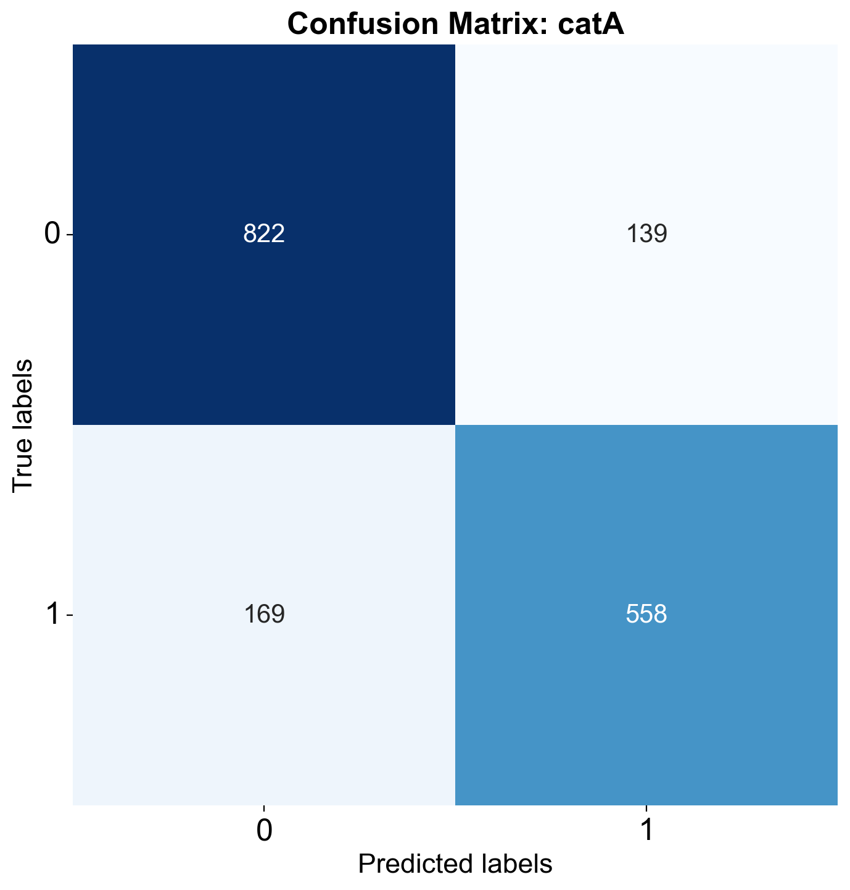
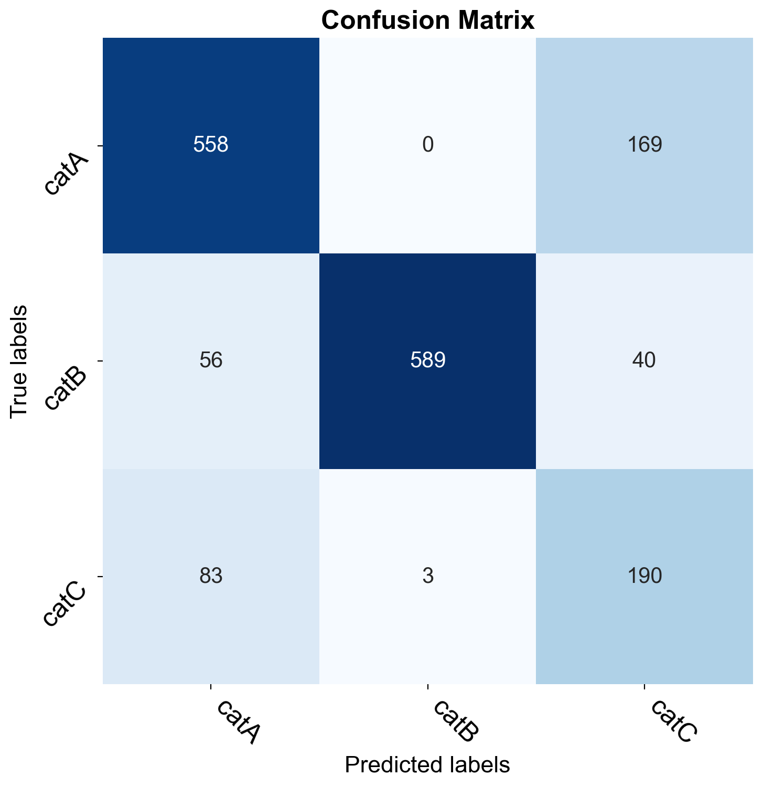

# {{ page.title }}
{: .mb-6}

It analyzes the confusion matrix of the model. The analysis can be performed for the entire data set or for a subset with a specific property value.

#### Parameters
<dl>
  

  <dt><strong>{{ param.name }}</strong></dt>
  <dd><br><b><i>{{ param.type }}</i></b></dd><dd>{{ param.description }}</dd>

  
</dl>

<hr>

### Example
#### Classification
```py
from odin.classes import AnalyzerClassification

my_analyzer = AnalyzerClassification("my_classifier_name", my_classification_dataset)
my_analyzer.analyze_confusion_matrix()
```

{:class="img-responsive" width="60%"}
{: .text-center}

<p style="font-size: 10px; text-align: right;">N.B. As example, it is shown only the output of a single category, but the analysis is performed for all the categories selected.</p>

{:class="img-responsive" width="75%"}
{: .text-center}

N.B. The confusion matrix among the categories is supported only for single-label classification task.
{: .text-right .fs-1}

<hr>

### Tasks supported
<table>
  <thead>
    <tr class="header">
      <th>Binary Classification</th>
      <th>Single-label Classification</th>
      <th>Multi-label Classification</th>
      <th>Object Detection</th>
      <th>Instance Segmentation</th>
    </tr>
  </thead>
  <tbody>
    <tr style="text-align:center;">
      <td style="background:lightgreen;">yes</td>
      <td style="background:lightgreen;">yes</td>
      <td style="background:lightgreen;">yes</td>
      <td style="background:lightcoral;">no</td>
      <td style="background:lightcoral;">no</td>
    </tr>
  </tbody>
</table>
