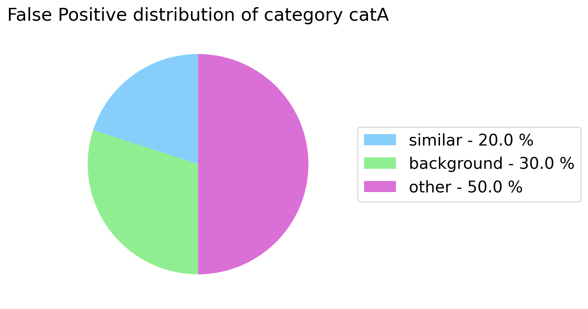
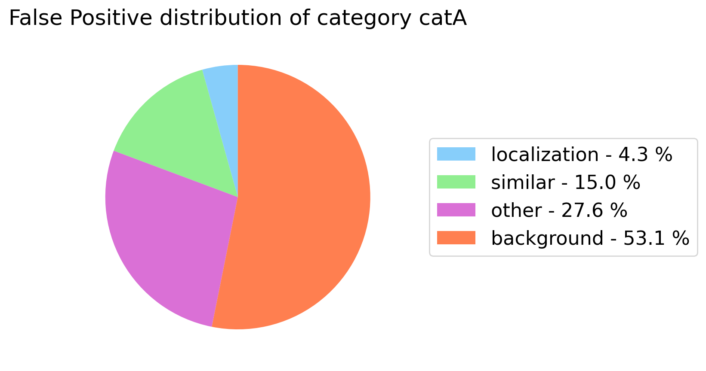

# {{ page.title }}
{: .mb-6}

It analyzes the false positives for a specific category, by identifying the type of the errors and shows the gain that the model could achieve by removing all the false positives of each type.

#### Parameters
<dl>
  

  <dt><strong>{{ param.name }}</strong></dt>
  <dd><br><b><i>{{ param.type }}</i></b></dd><dd>{{ param.description }}</dd>

  
</dl>

<hr>

### Example
#### Classification
```py
from odin.classes import AnalyzerClassification

my_analyzer = AnalyzerClassification("my_classifier_name", my_classification_dataset)
my_analyzer.analyze_false_positive_error_for_category('catA')
```

{:class="img-responsive" width="75%"}
{: .text-center}
{:class="img-responsive" width="75%"}
{: .text-center}

#### Localization
```py
from odin.classes import AnalyzerLocalization

my_analyzer = AnalyzerLocalization("my_detector_name", my_localization_dataset)
my_analyzer.analyze_false_positive_error_for_category('catA')
```

{:class="img-responsive" width="75%"}
{: .text-center}
{:class="img-responsive" width="75%"}
{: .text-center}

<hr>

### Tasks supported
<table>
  <thead>
    <tr class="header">
      <th>Binary Classification</th>
      <th>Single-label Classification</th>
      <th>Multi-label Classification</th>
      <th>Object Detection</th>
      <th>Instance Segmentation</th>
    </tr>
  </thead>
  <tbody>
    <tr style="text-align:center;">
      <td style="background:lightcoral;">no</td>
      <td style="background:lightgreen;">yes</td>
      <td style="background:lightgreen;">yes</td>
      <td style="background:lightgreen;">yes</td>
      <td style="background:lightgreen;">yes</td>
    </tr>
  </tbody>
</table>
