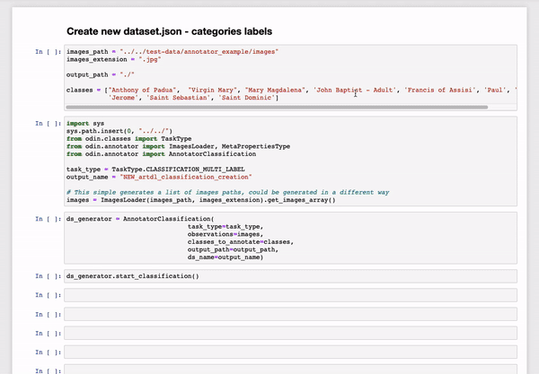
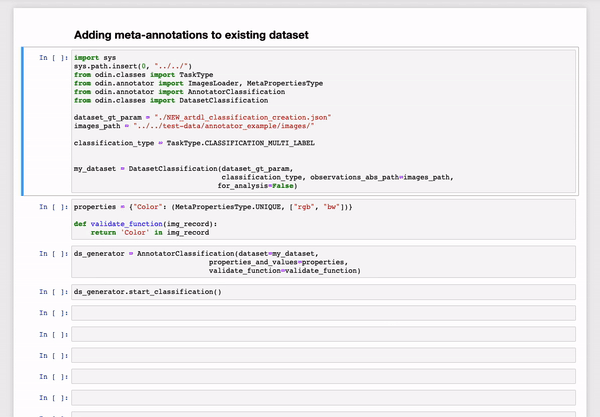
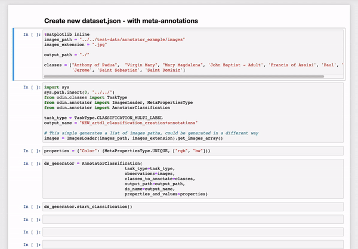
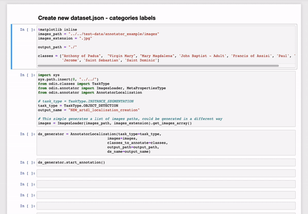
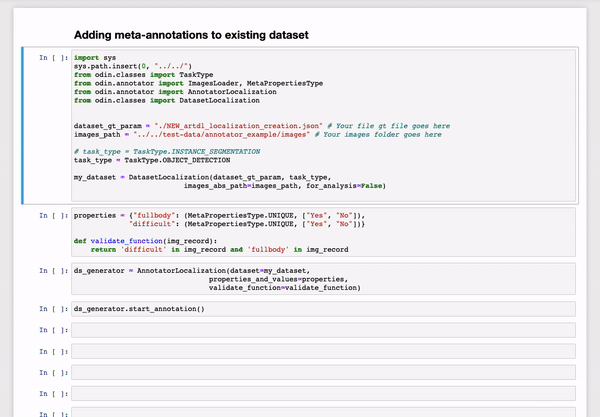
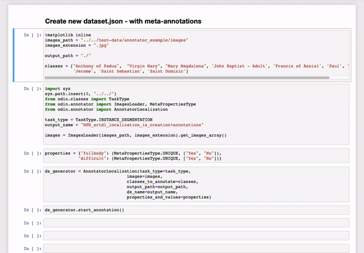

# {{ page.title }}
{: .mb-6}

The Annotator component provides a GUI which allows the user to create or modify his data set with categories labels and/or meta-annotations.

<hr>

## AnnotatorClassification

The AnnotatorClassification class can be used to annotate data sets for classification tasks.

#### Parameters
<dl>
  

  <dt><strong>{{ param.name }}</strong></dt>
  <dd><br><b><i>{{ param.type }}</i></b></dd><dd>{{ param.description }}</dd>

  
</dl>

### Example

#### Annotate a new data set with only categories labels
```py
from odin.annotator import AnnotatorClassification

task_type = TaskType.CLASSIFICATION_MULTI_LABEL
images = ["path/image1.jpg", "path/image2.jpg", "...", "path/imagen.jpg"]
classes_to_annotate = ["category_a", "category_b", "...", "category_n"]
dataset_name = "my_dataset_name"
output_path = "new/dataset/output/path/"

my_annotator = AnnotatorClassification(task_type=task_type,
                                       observations=images,
                                       classes_to_annotate=classes,
                                       output_path=output_path,
                                       ds_name=dataset_name)
my_annotator.start_classification()
```
{:class="img-responsive" style="max-width:800px"}
{: .text-center}

#### Annotate an existing data set with only meta-annotations
```py
from odin.classes import DatasetClassification
from odin.annotator import AnnotatorClassification

dataset_gt = "path/to/gt/file.json"
images_path = "path/to/images"
classification_type = TaskType.CLASSIFICATION_MULTI_LABEL

my_dataset = DatasetClassification(dataset_gt,
                                   classification_type,
                                   observations_abs_path=images_path,
                                   for_analysis=False)

meta_annotations = {"property_name": (MetaPropertiesType.UNIQUE, ["value1", "value2"])}

def validate_function(img_record):
    return 'property_name' in img_record

my_annotator = AnnotatorClassification(dataset=my_dataset,
                                       properties_and_values=meta_annotations,
                                       validate_function=validate_function)

my_annotator.start_classification()
```
{:class="img-responsive" style="max-width:800px"}
{: .text-center}

#### Annotate a new data set with categories labels and meta-annotations
```py
from odin.annotator import AnnotatorClassification

task_type = TaskType.CLASSIFICATION_MULTI_LABEL
images = ["path/image1.jpg", "path/image2.jpg", "...", "path/imagen.jpg"]
classes_to_annotate = ["category_a", "category_b", "...", "category_n"]
dataset_name = "my_dataset_name"
output_path = "new/dataset/output/path/"
meta_annotations = {"property_name": (MetaPropertiesType.UNIQUE, ["value1", "value2"])}

my_annotator = AnnotatorClassification(task_type=task_type,
                                       observations=images,
                                       classes_to_annotate=classes,
                                       output_path=output_path,
                                       ds_name=dataset_name,
                                       properties_and_values=meta_annotations)
my_annotator.start_classification()
```
{:class="img-responsive" style="max-width:800px"}
{: .text-center}

<hr>

## AnnotatorLocalization

The AnnotatorLocalization class can be used to annotate data sets for localization tasks, such as object detection (it is possible to draw and annotate bounding boxes) and instance segmentation (it is possible to draw and annotate segmentation masks).

#### Parameters
<dl>
  
  <dt><strong>{{ param.name }}</strong></dt>
  <dd><br><b><i>{{ param.type }}</i></b></dd><dd>{{ param.description }}</dd>

  
</dl>

### Example

#### Annotate a new data set with only categories labels
```py
from odin.annotator import AnnotatorLocalization

task_type = TaskType.OBJECT_DETECTION
images = ["path/image1.jpg", "path/image2.jpg", "...", "path/imagen.jpg"]
classes_to_annotate = ["category_a", "category_b", "...", "category_n"]
dataset_name = "my_dataset_name"
output_path = "new/dataset/output/path/"

my_annotator = AnnotatorLocalization(task_type=task_type,
                                     images=images,
                                     classes_to_annotate=classes,
                                     output_path=output_path,
                                     ds_name=dataset_name)
my_annotator.start_annotation()
```
{:class="img-responsive" style="max-width:800px"}
{: .text-center}

#### Annotate an existing data set with only meta-annotations
```py
from odin.classes import DatasetLocalization
from odin.annotator import AnnotatorLocalization

dataset_gt = "path/to/gt/file.json"
images_path = "path/to/images"
classification_type = TaskType.OBJECT_DETECTION

my_dataset = DatasetLocalization(dataset_gt,
                                 classification_type,
                                 images_abs_path=images_path,
                                 for_analysis=False)

meta_annotations = {"property_name": (MetaPropertiesType.UNIQUE, ["value1", "value2"])}

def validate_function(img_record):
    return 'property_name' in img_record

my_annotator = AnnotatorLocalization(dataset=my_dataset,
                                     properties_and_values=meta_annotations,
                                     validate_function=validate_function)

my_annotator.start_annotation()
```
{:class="img-responsive" style="max-width:800px"}
{: .text-center}

#### Annotate a new data set with categories labels and meta-annotations
```py
from odin.annotator import AnnotatorLocalization

task_type = TaskType.INSTANCE_SEGMENTATION
images = ["path/image1.jpg", "path/image2.jpg", "...", "path/imagen.jpg"]
classes_to_annotate = ["category_a", "category_b", "...", "category_n"]
dataset_name = "my_dataset_name"
output_path = "new/dataset/output/path/"
meta_annotations = {"property_name": (MetaPropertiesType.UNIQUE, ["value1", "value2"])}

my_annotator = AnnotatorLocalization(task_type=task_type,
                                     images=images,
                                     classes_to_annotate=classes,
                                     output_path=output_path,
                                     ds_name=dataset_name,
                                     properties_and_values=meta_annotations)
my_annotator.start_annotation()
```
{:class="img-responsive" style="max-width:800px"}
{: .text-center}
