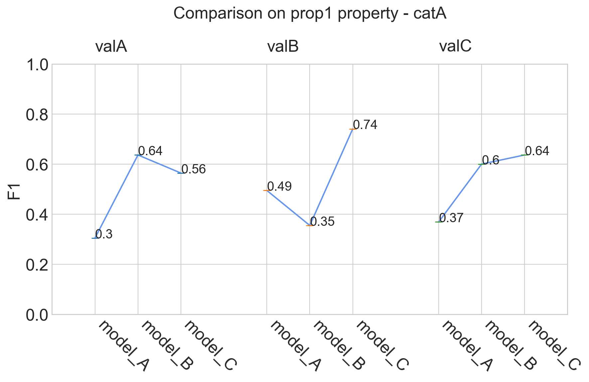
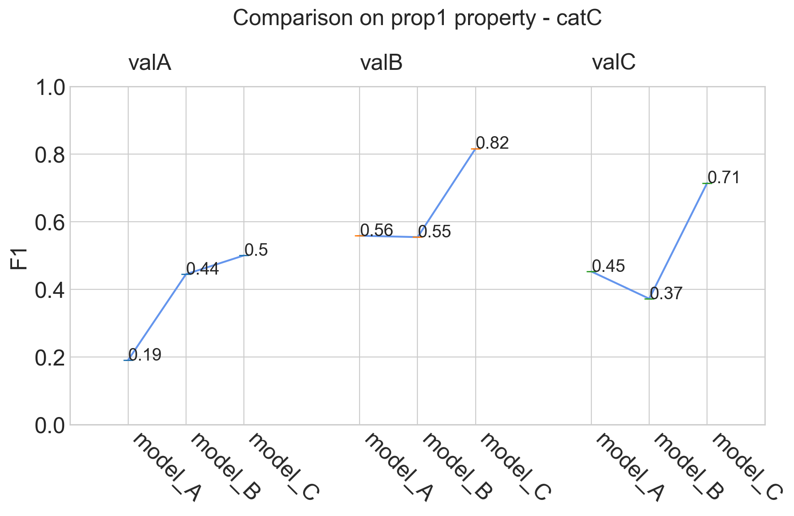

# {{ page.title }}
{: .mb-6}

It compares the performances of the models for each category considering subsets pf the data set which have a specific property value.


#### Parameters
<dl>
  

  <dt><strong>{{ param.name }}</strong></dt>
  <dd><br><b><i>{{ param.type }}</i></b></dd><dd>{{ param.description }}</dd>

  
</dl>

<hr>

### Example

#### Classification
```py
from odin.classes import ComparatorClassification

my_comparator = ComparatorClassification(dataset_gt_param, classification_type, models_proposals)
my_comparator.compare_models_on_property('prop1')
```

#### Localization
```py
from odin.classes import ComparatorLocalization

my_comparator = ComparatorLocalization(dataset_gt_param, task_type, models_proposals)
my_comparator.compare_models_on_property('prop1')
```

{:class="img-responsive" width="75%"}
{: .text-center}

{:class="img-responsive" width="75%"}
{: .text-center}

{:class="img-responsive" width="75%"}
{: .text-center}

<hr>

### Tasks supported
<table>
  <thead>
    <tr class="header">
      <th>Binary Classification</th>
      <th>Single-label Classification</th>
      <th>Multi-label Classification</th>
      <th>Object Detection</th>
      <th>Instance Segmentation</th>
    </tr>
  </thead>
  <tbody>
    <tr style="text-align:center;">
      <td style="background:lightgreen;">yes</td>
      <td style="background:lightgreen;">yes</td>
      <td style="background:lightgreen;">yes</td>
      <td style="background:lightgreen;">yes</td>
      <td style="background:lightgreen;">yes</td>
    </tr>
  </tbody>
</table>
