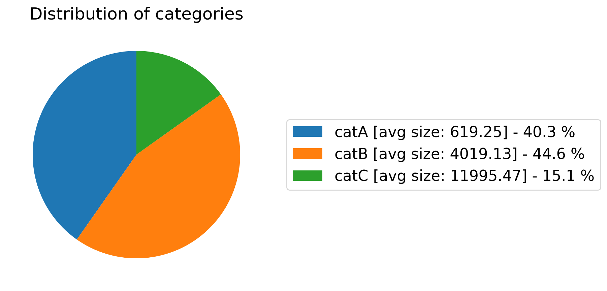

# {{ page.title }}
{: .no_toc}

<details open markdown="block">
  <summary>
    Table of contents
  </summary>
  {: .text-delta }
- TOC
{:toc}
</details>

<hr>

# show_distribution_of_property()
{: .mb-6}

It provides the distribution of the different values of a property and for each value shows the
distribution of the categories.


#### Parameters
{: .no_toc}
<dl>
  

  <dt><strong>{{ param.name }}</strong></dt>
  <dd><br><b><i>{{ param.type }}</i></b></dd><dd>{{ param.description }}</dd>

  
</dl>

<hr>

### Example
{: .no_toc}
#### Classification
{: .no_toc}
```py
from odin.classes import DatasetClassification

my_dataset = DatasetClassification(dataset_gt_param, classification_type)
my_dataset.show_distribution_of_property('prop1')
```
#### Localization
{: .no_toc}
```py
from odin.classes import DatasetLocalization

my_dataset = DatasetLocalization(dataset_gt_param, localization_type)
my_dataset.show_distribution_of_property('prop1')
```

{:class="img-responsive" width="75%"}
{: .text-center}

{:class="img-responsive" width="75%"}
{: .text-center}

{:class="img-responsive" width="75%"}
{: .text-center}

<hr>

### Tasks supported
{: .no_toc}
<table>
  <thead>
    <tr class="header">
      <th>Binary Classification</th>
      <th>Single-label Classification</th>
      <th>Multi-label Classification</th>
      <th>Object Detection</th>
      <th>Instance Segmentation</th>
    </tr>
  </thead>
  <tbody>
    <tr style="text-align:center;">
      <td style="background:lightgreen;">yes</td>
      <td style="background:lightgreen;">yes</td>
      <td style="background:lightgreen;">yes</td>
      <td style="background:lightgreen;">yes</td>
      <td style="background:lightgreen;">yes</td>
    </tr>
  </tbody>
</table>

<hr>

# show_distribution_of_properties()
{: .mb-6}

For each property, it provides the distribution of its different values and for each value shows the
distribution of the categories.


#### Parameters
{: .no_toc}
<dl>
  

  <dt><strong>{{ param.name }}</strong></dt>
  <dd><br><b><i>{{ param.type }}</i></b></dd><dd>{{ param.description }}</dd>

  
</dl>

<hr>

### Example
{: .no_toc}
#### Classification
{: .no_toc}
```py
from odin.classes import DatasetClassification

my_dataset = DatasetClassification(dataset_gt_param, classification_type)
my_dataset.show_distribution_of_properties()
```
#### Localization
{: .no_toc}
```py
from odin.classes import DatasetLocalization

my_dataset = DatasetLocalization(dataset_gt_param, localization_type)
my_dataset.show_distribution_of_properties()
```

{:class="img-responsive" width="75%"}
{: .text-center}

{:class="img-responsive" width="75%"}
{: .text-center}

{:class="img-responsive" width="75%"}
{: .text-center}

<hr>

### Tasks supported
{: .no_toc}
<table>
  <thead>
    <tr class="header">
      <th>Binary Classification</th>
      <th>Single-label Classification</th>
      <th>Multi-label Classification</th>
      <th>Object Detection</th>
      <th>Instance Segmentation</th>
    </tr>
  </thead>
  <tbody>
    <tr style="text-align:center;">
      <td style="background:lightgreen;">yes</td>
      <td style="background:lightgreen;">yes</td>
      <td style="background:lightgreen;">yes</td>
      <td style="background:lightgreen;">yes</td>
      <td style="background:lightgreen;">yes</td>
    </tr>
  </tbody>
</table>

<hr>

# show_distribution_of_property_for_category()
{: .mb-6}

It provides the distribution of a property for a specific category.


#### Parameters
{: .no_toc}
<dl>
  

  <dt><strong>{{ param.name }}</strong></dt>
  <dd><br><b><i>{{ param.type }}</i></b></dd><dd>{{ param.description }}</dd>

  
</dl>

<hr>

### Example
{: .no_toc}
#### Classification
{: .no_toc}
```py
from odin.classes import DatasetClassification

my_dataset = DatasetClassification(dataset_gt_param, classification_type)
my_dataset.show_distribution_of_property_for_category('prop1', 'catA')
```
#### Localization
{: .no_toc}
```py
from odin.classes import DatasetLocalization

my_dataset = DatasetLocalization(dataset_gt_param, localization_type)
my_dataset.show_distribution_of_property_for_category('prop1', 'catA')
```

{:class="img-responsive" width="75%"}
{: .text-center}

<hr>

### Tasks supported
{: .no_toc}
<table>
  <thead>
    <tr class="header">
      <th>Binary Classification</th>
      <th>Single-label Classification</th>
      <th>Multi-label Classification</th>
      <th>Object Detection</th>
      <th>Instance Segmentation</th>
    </tr>
  </thead>
  <tbody>
    <tr style="text-align:center;">
      <td style="background:lightgreen;">yes</td>
      <td style="background:lightgreen;">yes</td>
      <td style="background:lightgreen;">yes</td>
      <td style="background:lightgreen;">yes</td>
      <td style="background:lightgreen;">yes</td>
    </tr>
  </tbody>
</table>

<hr>

# show_distribution_of_property_for_categories()
{: .mb-6}

For each category, it provides the distribution of a property.


#### Parameters
{: .no_toc}
<dl>
  

  <dt><strong>{{ param.name }}</strong></dt>
  <dd><br><b><i>{{ param.type }}</i></b></dd><dd>{{ param.description }}</dd>

  
</dl>

<hr>

### Example
{: .no_toc}
#### Classification
{: .no_toc}
```py
from odin.classes import DatasetClassification

my_dataset = DatasetClassification(dataset_gt_param, classification_type)
my_dataset.show_distribution_of_property_for_categories('prop1')
```
#### Localization
{: .no_toc}
```py
from odin.classes import DatasetLocalization

my_dataset = DatasetLocalization(dataset_gt_param, localization_type)
my_dataset.show_distribution_of_property_for_categories('prop1')
```

{:class="img-responsive" width="75%"}
{: .text-center}

{:class="img-responsive" width="75%"}
{: .text-center}

<hr>

### Tasks supported
{: .no_toc}
<table>
  <thead>
    <tr class="header">
      <th>Binary Classification</th>
      <th>Single-label Classification</th>
      <th>Multi-label Classification</th>
      <th>Object Detection</th>
      <th>Instance Segmentation</th>
    </tr>
  </thead>
  <tbody>
    <tr style="text-align:center;">
      <td style="background:lightgreen;">yes</td>
      <td style="background:lightgreen;">yes</td>
      <td style="background:lightgreen;">yes</td>
      <td style="background:lightgreen;">yes</td>
      <td style="background:lightgreen;">yes</td>
    </tr>
  </tbody>
</table>

<hr>

# show_distribution_of_categories()
{: .mb-6}

It provides the distribution of the categories in the data set.


#### Parameters
{: .no_toc}
<dl>
  

  <dt><strong>{{ param.name }}</strong></dt>
  <dd><br><b><i>{{ param.type }}</i></b></dd><dd>{{ param.description }}</dd>

  
</dl>

<hr>

### Example
{: .no_toc}
#### Classification
{: .no_toc}
```py
from odin.classes import DatasetClassification

my_dataset = DatasetClassification(dataset_gt_param, classification_type)
my_dataset.show_distribution_of_categories()
```

{:class="img-responsive" width="75%"}
{: .text-center}


#### Localization
{: .no_toc}
```py
from odin.classes import DatasetLocalization

my_dataset = DatasetLocalization(dataset_gt_param, localization_type)
my_dataset.show_distribution_of_categories()
```

{:class="img-responsive" width="100%"}
{: .text-center}


<hr>

### Tasks supported
{: .no_toc}
<table>
  <thead>
    <tr class="header">
      <th>Binary Classification</th>
      <th>Single-label Classification</th>
      <th>Multi-label Classification</th>
      <th>Object Detection</th>
      <th>Instance Segmentation</th>
    </tr>
  </thead>
  <tbody>
    <tr style="text-align:center;">
      <td style="background:lightgreen;">yes</td>
      <td style="background:lightgreen;">yes</td>
      <td style="background:lightgreen;">yes</td>
      <td style="background:lightgreen;">yes</td>
      <td style="background:lightgreen;">yes</td>
    </tr>
  </tbody>
</table>
