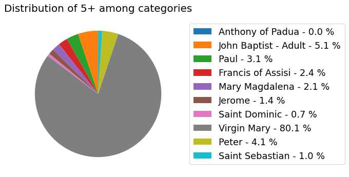
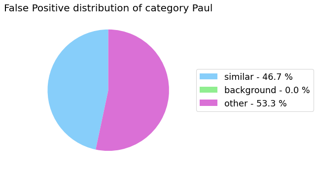

[[Notebook example]](https://github.com/rnt-pmi/odin/tree/master/examples){:target="_blank"}
{: .text-right .fs-2}

# {{ page.title }} - a multi label classification task example
{: .mb-6}

### Package import and variables definition
```py
from odin.classes import TaskType, Metrics, Curves, CustomMetric, DatasetClassification, AnalyzerClassification

# define the path of the GT .json file
dataset_gt_param = "../../test-data/classification-ml/gt_art.json"

# define the path of the folder that contains the predictions .txt files for each model
path_to_detections = "../../test-data/classification-ml/predictions"

# define the task type
classification_type = TaskType.CLASSIFICATION_MULTI_LABEL

# define groups of categories which are similar to each other (useful for the error analysis)
similar_classes=[[1, 4, 7], [2, 6, 10], [5, 8], [3, 6, 9]]

# define the file_name for the meta-annotations
properties_file = "properties_art.json"
```

### Dataset
```py
my_dataset = DatasetClassification(dataset_gt_param,
                                   classification_type,
                                   proposals_paths=path_to_detections,
                                   similar_classes=similar_classes,
                                   properties_file=properties_file,
                                   save_graphs_as_png=False)
```
{:class="img-responsive" style="max-width:300px"}
{: .text-center}

#### Categories distribution
```py
my_dataset.show_distribution_of_categories()
```
{:class="img-responsive" style="max-width:400px"}
{: .text-center}

#### Properties distribution
```py
my_dataset.show_distribution_of_properties()
```
{:class="img-responsive" style="max-width:300px"}
{:class="img-responsive" style="max-width:300px"}
{: .text-center}
{:class="img-responsive" style="max-width:300px"}
{:class="img-responsive" style="max-width:300px"}
{:class="img-responsive" style="max-width:300px"}
{:class="img-responsive" style="max-width:300px"}
{:class="img-responsive" style="max-width:300px"}
{: .text-center}


### Analyzer
```py
my_analyzer = AnalyzerClassification('my_model',
                                     my_dataset,
                                     metric=Metrics.F1_SCORE,
                                     save_graphs_as_png=False)
```

#### Properties analysis
```py
my_analyzer.analyze_properties()
```
{:class="img-responsive" style="max-width:800px"}
{:class="img-responsive" style="max-width:800px"}
{: .text-center}

#### Sensitivity and impact analysis
```py
my_analyzer.analyze_sensitivity_impact_of_properties()
```
{:class="img-responsive" style="max-width:500px"}
{: .text-center}

#### False Positive categorization and impact
```py
my_analyzer.analyze_false_positive_errors()
```
{:class="img-responsive" style="max-width:400px"}
{:class="img-responsive" style="max-width:400px"}
{: .text-center}
{:class="img-responsive" style="max-width:400px"}
{:class="img-responsive" style="max-width:400px"}
{: .text-center}
{:class="img-responsive" style="max-width:400px"}
{:class="img-responsive" style="max-width:400px"}
{: .text-center}
{:class="img-responsive" style="max-width:400px"}
{:class="img-responsive" style="max-width:400px"}
{: .text-center}
{:class="img-responsive" style="max-width:400px"}
{:class="img-responsive" style="max-width:400px"}
{: .text-center}
{:class="img-responsive" style="max-width:400px"}
{:class="img-responsive" style="max-width:400px"}
{: .text-center}
{:class="img-responsive" style="max-width:400px"}
{:class="img-responsive" style="max-width:400px"}
{: .text-center}
{:class="img-responsive" style="max-width:400px"}
{:class="img-responsive" style="max-width:400px"}
{: .text-center}
{:class="img-responsive" style="max-width:400px"}
{:class="img-responsive" style="max-width:400px"}
{: .text-center}
{:class="img-responsive" style="max-width:400px"}
{:class="img-responsive" style="max-width:400px"}
{: .text-center}

#### False Negative categorization
```py
my_analyzer.analyze_false_negative_errors()
```
{:class="img-responsive" style="max-width:400px"}
{:class="img-responsive" style="max-width:400px"}
{:class="img-responsive" style="max-width:400px"}
{:class="img-responsive" style="max-width:400px"}
{:class="img-responsive" style="max-width:400px"}
{:class="img-responsive" style="max-width:400px"}
{:class="img-responsive" style="max-width:400px"}
{:class="img-responsive" style="max-width:400px"}
{:class="img-responsive" style="max-width:400px"}
{:class="img-responsive" style="max-width:400px"}
{: .text-center}

#### Precision-Recall curve - Overall
```py
my_analyzer.analyze_curve(average="micro")
```
{:class="img-responsive" style="max-width:800px"}
{: .text-center}

#### Precision-Recall curve - Per-category
```py
my_analyzer.analyze_curve_for_categories()
```
{:class="img-responsive" style="max-width:800px"}
{: .text-center}

#### Reliability analysis
```py
my_analyzer.analyze_reliability()
```
{:class="img-responsive" style="max-width:800px"}
{: .text-center}

#### Performance summary
```py
my_analyzer.base_report()
```
{:class="img-responsive" style="max-width:800px"}
{: .text-center}
