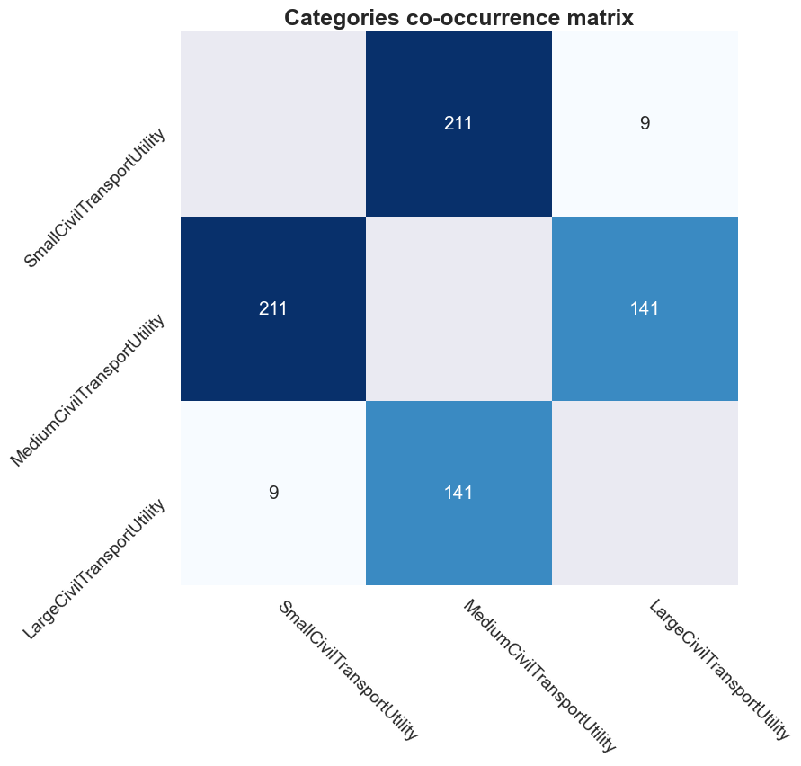
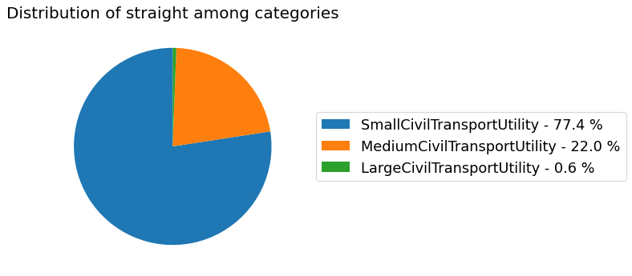
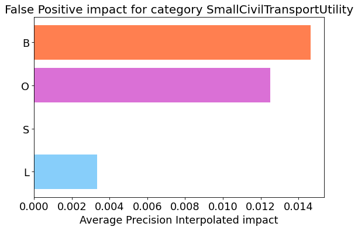
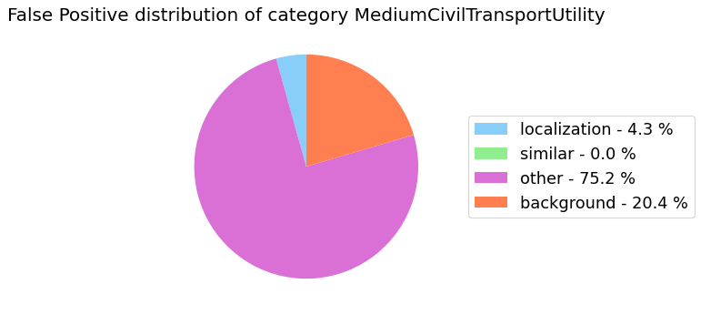
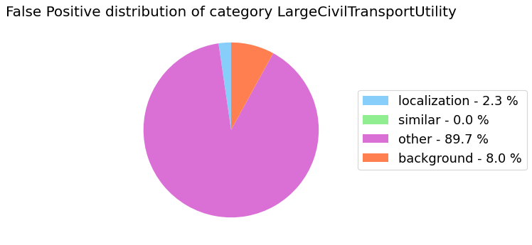
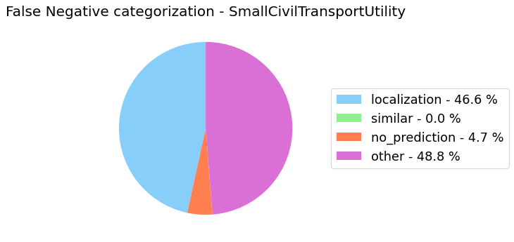
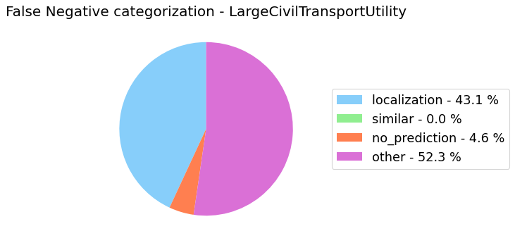
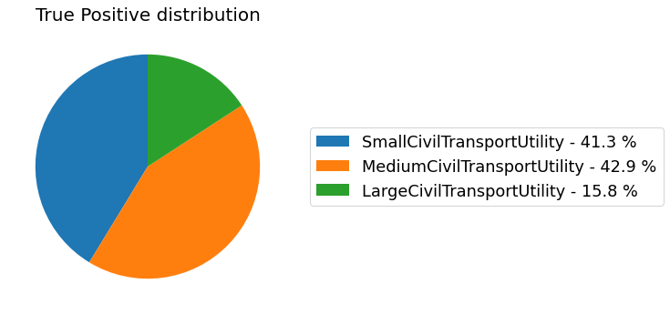

[[Notebook example]](https://github.com/rnt-pmi/odin/tree/master/examples)
{: .text-right .fs-2}

# {{ page.title }}
{: .mb-6}

### Package import and variables definition
```py
from odin.classes import DatasetLocalization, AnalyzerLocalization, Metrics, TaskType, Curves

# define the path of the GT .json file
dataset_gt_param = "../../test-data/localization/gt.json"

# define the path of the folder that contains the predictions .txt files for each model
path_to_detections = [("my_model", "../../test-data/localization/predictions-segmentation/")]

# define the problem task
task_type = TaskType.INSTANCE_SEGMENTATION

# define the file_name for the meta-annotations
properties_file = "properties_plane.json"
```

### Dataset
```py
my_dataset = DatasetClassification(dataset_gt_param,
                                   classification_type,
                                   proposals_paths=path_to_detections,
                                   similar_classes=similar_classes,
                                   properties_file=properties_file,
                                   save_graphs_as_png=False)
```
{:class="img-responsive" style="max-width:300px"}
{: .text-center}

#### Co-occurrence matrix
```py
my_dataset.show_co_occurrence_matrix()
```
{:class="img-responsive" style="max-width:400px"}
{: .text-center}

#### Categories distribution
```py
my_dataset.show_distribution_of_categories()
```
{:class="img-responsive" style="max-width:500px"}
{: .text-center}

#### Properties distribution
```py
my_dataset.show_distribution_of_properties()
```
{:class="img-responsive" style="max-width:300px"}
{:class="img-responsive" style="max-width:300px"}
{:class="img-responsive" style="max-width:300px"}
{: .text-center}

{:class="img-responsive" style="max-width:300px"}
{:class="img-responsive" style="max-width:300px"}
{:class="img-responsive" style="max-width:300px"}
{:class="img-responsive" style="max-width:300px"}
{:class="img-responsive" style="max-width:300px"}
{:class="img-responsive" style="max-width:300px"}
{:class="img-responsive" style="max-width:300px"}
{:class="img-responsive" style="max-width:300px"}
{:class="img-responsive" style="max-width:300px"}
{: .text-center}

### Analyzer
```py
my_analyzer = AnalyzerLocalization('my_model',
                                   my_dataset,
                                   use_normalization=True,
                                   norm_factor_categories=0.3,
                                   metric=Metrics.AVERAGE_PRECISION_INTERPOLATED,
                                   save_graphs_as_png=False)

my_analyzer.set_normalization(True, with_properties=False)
```

#### Properties analysis
```py
my_analyzer.analyze_properties()
```
{:class="img-responsive" style="max-width:500px"}
{:class="img-responsive" style="max-width:500px"}
{:class="img-responsive" style="max-width:500px"}
{: .text-center}

#### Sensitivity and impact analysis
```py
my_analyzer.analyze_sensitivity_impact_of_properties()
```
{:class="img-responsive" style="max-width:500px"}
{: .text-center}

#### False Positive categorization and impact
```py
my_analyzer.analyze_false_positive_errors()
```
{:class="img-responsive" style="max-width:400px"}
{:class="img-responsive" style="max-width:400px"}
{: .text-center}
{:class="img-responsive" style="max-width:400px"}
{:class="img-responsive" style="max-width:400px"}
{: .text-center}
{:class="img-responsive" style="max-width:400px"}
{:class="img-responsive" style="max-width:400px"}
{: .text-center}

#### False Negative categorization
```py
my_analyzer.analyze_false_negative_errors()
```
{:class="img-responsive" style="max-width:400px"}
{:class="img-responsive" style="max-width:400px"}
{:class="img-responsive" style="max-width:400px"}
{: .text-center}

#### Precision-Recall Curve - Overall
```py
my_analyzer.analyze_curve(average="micro")
```
{:class="img-responsive" style="max-width:800px"}
{: .text-center}

#### Precision-Recall Curve - Per-category
```py
my_analyzer.analyze_curve_for_categories()
```
{:class="img-responsive" style="max-width:800px"}
{: .text-center}

#### IoU analysis
```py
my_analyzer.analyze_intersection_over_union()
```
{:class="img-responsive" style="max-width:800px"}
{: .text-center}

#### Reliability analysis
```py
my_analyzer.analyze_reliability()
```
{:class="img-responsive" style="max-width:800px"}
{: .text-center}

#### True Positive distribution
```py
my_analyzer.show_true_positive_distribution()
```
{:class="img-responsive" style="max-width:400px"}
{: .text-center}

#### False Negative distribution
```py
my_analyzer.show_false_negative_distribution()
```
{:class="img-responsive" style="max-width:400px"}
{: .text-center}

#### False Positive distribution
```py
my_analyzer.show_false_positive_distribution()
```
{:class="img-responsive" style="max-width:400px"}
{: .text-center}

#### Performance summary
```py
my_analyzer.base_report()
```
{:class="img-responsive" style="max-width:800px"}
{: .text-center}
