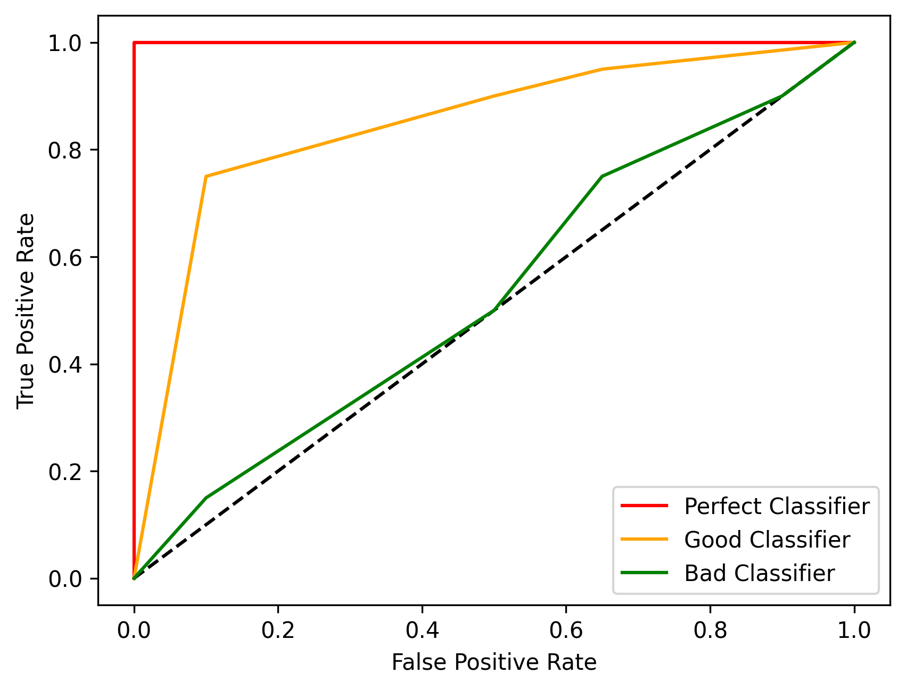

# {{ page.title }}
{: .mb-6}

{{ site.data.metrics[page.title].description }}

{{ site.data.metrics[page.title].formula }}
{: .text-center}

{:class="img-responsive;" width="75%"}
{: .text-center}

### Example
```py
from odin.classes import Curves

my_curve = Curves.ROC_CURVE
# use my_curve as 'curve' parameter in the analyses
```

### Tasks supported
<table>
  <thead>
    <tr class="header">
      <th>Binary Classification</th>
      <th>Single-label Classification</th>
      <th>Multi-label Classification</th>
      <th>Object Detection</th>
      <th>Instance Segmentation</th>
    </tr>
  </thead>
  <tbody>
    <tr style="text-align:center;">
      <td style="background:lightgreen;">yes</td>
      <td style="background:lightgreen;">yes</td>
      <td style="background:lightgreen;">yes</td>
      <td style="background:lightcoral;">no</td>
      <td style="background:lightcoral;">no</td>
    </tr>
  </tbody>
</table>
