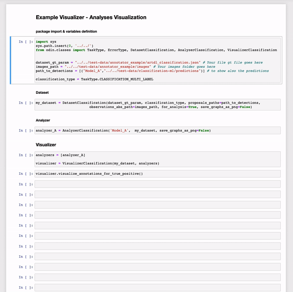
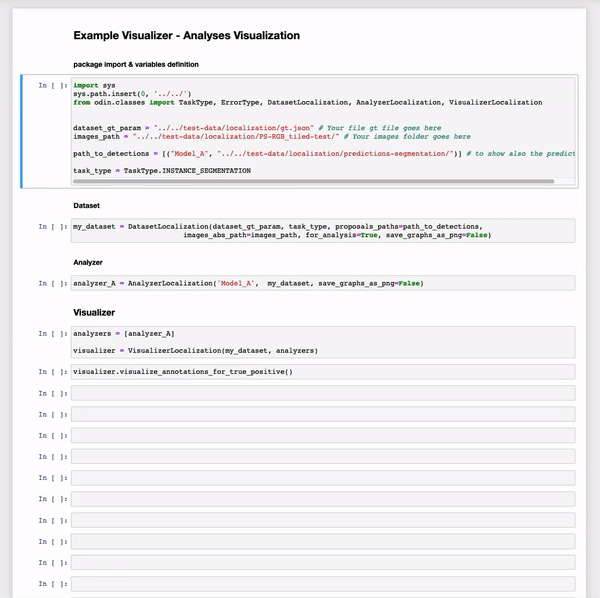

# {{page.title}}
{: .no_toc}

<details open markdown="block">
  <summary>
    Table of contents
  </summary>
  {: .text-delta }
- TOC
{:toc}
</details>

<hr>

<div class="row">
  <div class="column">
    <b>Classification Example</b>
    
  </div>
  <div class="column">
    <b>Localization Example</b>
    
  </div>
</div>

<style>
  .row {
  display: flex;
  }

  .column {
    text-align: center;
    flex: 50%;
    margin: 0 auto;
    max-width: 600px;
  }

  @media (max-width: 1400px) {
    .row {
      display: block;
    }
    .column {
      flex: 100%;
    }
}
</style>

<hr>

# visualize_annotations_for_true_positive()
{: .mb-6}

It shows the ground truth and the predictions based on the true positive analysis.

#### Parameters
{: .no_toc}
<dl>
  

  <dt><strong>{{ param.name }}</strong></dt>
  <dd><br><b><i>{{ param.type }}</i></b></dd><dd>{{ param.description }}</dd>

  
</dl>

<hr>

### Example
{: .no_toc}
#### Classification
{: .no_toc}
```py
from odin.classes import VisualizerClassification

my_visualizer = VisualizerClassification(models)
my_visualizer.visualize_annotations_for_true_positive()
```


#### Localization
{: .no_toc}
```py
from odin.classes import VisualizerLocalization

my_visualizer = VisualizerLocalization(models)
my_visualizer.visualize_annotations_for_true_positive()
```


<hr>

### Tasks supported
{: .no_toc}
<table>
  <thead>
    <tr class="header">
      <th>Binary Classification</th>
      <th>Single-label Classification</th>
      <th>Multi-label Classification</th>
      <th>Object Detection</th>
      <th>Instance Segmentation</th>
    </tr>
  </thead>
  <tbody>
    <tr style="text-align:center;">
      <td style="background:lightgreen;">yes</td>
      <td style="background:lightgreen;">yes</td>
      <td style="background:lightgreen;">yes</td>
      <td style="background:lightgreen;">yes</td>
      <td style="background:lightgreen;">yes</td>
    </tr>
  </tbody>
</table>

<hr>

# visualize_annotations_for_false_positive()
{: .mb-6}

It shows the ground truth and the predictions based on the false positive analysis.

#### Parameters
{: .no_toc}
<dl>
  

  <dt><strong>{{ param.name }}</strong></dt>
  <dd><br><b><i>{{ param.type }}</i></b></dd><dd>{{ param.description }}</dd>

  
</dl>

<hr>

### Example
{: .no_toc}
#### Classification
{: .no_toc}
```py
from odin.classes import VisualizerClassification

my_visualizer = VisualizerClassification(models)
my_visualizer.visualize_annotations_for_false_positive()
```


#### Localization
{: .no_toc}
```py
from odin.classes import VisualizerLocalization

my_visualizer = VisualizerLocalization(models)
my_visualizer.visualize_annotations_for_false_positive()
```


<hr>

### Tasks supported
{: .no_toc}
<table>
  <thead>
    <tr class="header">
      <th>Binary Classification</th>
      <th>Single-label Classification</th>
      <th>Multi-label Classification</th>
      <th>Object Detection</th>
      <th>Instance Segmentation</th>
    </tr>
  </thead>
  <tbody>
    <tr style="text-align:center;">
      <td style="background:lightgreen;">yes</td>
      <td style="background:lightgreen;">yes</td>
      <td style="background:lightgreen;">yes</td>
      <td style="background:lightgreen;">yes</td>
      <td style="background:lightgreen;">yes</td>
    </tr>
  </tbody>
</table>

<hr>

# visualize_annotations_for_false_negative()
{: .mb-6}

It shows the ground truth and the predictions based on the false negative analysis.

#### Parameters
{: .no_toc}
<dl>
  

  <dt><strong>{{ param.name }}</strong></dt>
  <dd><br><b><i>{{ param.type }}</i></b></dd><dd>{{ param.description }}</dd>

  
</dl>

<hr>

### Example
{: .no_toc}
#### Classification
{: .no_toc}
```py
from odin.classes import VisualizerClassification

my_visualizer = VisualizerClassification(models)
my_visualizer.visualize_annotations_for_false_negative()
```


#### Localization
{: .no_toc}
```py
from odin.classes import VisualizerLocalization

my_visualizer = VisualizerLocalization(models)
my_visualizer.visualize_annotations_for_false_negative()
```


<hr>

### Tasks supported
{: .no_toc}
<table>
  <thead>
    <tr class="header">
      <th>Binary Classification</th>
      <th>Single-label Classification</th>
      <th>Multi-label Classification</th>
      <th>Object Detection</th>
      <th>Instance Segmentation</th>
    </tr>
  </thead>
  <tbody>
    <tr style="text-align:center;">
      <td style="background:lightgreen;">yes</td>
      <td style="background:lightgreen;">yes</td>
      <td style="background:lightgreen;">yes</td>
      <td style="background:lightgreen;">yes</td>
      <td style="background:lightgreen;">yes</td>
    </tr>
  </tbody>
</table>

<hr>

# visualize_annotations_for_true_negative()
{: .mb-6}

It shows the ground truth and the predictions based on the true negative analysis.

#### Parameters
{: .no_toc}
<dl>
  

  <dt><strong>{{ param.name }}</strong></dt>
  <dd><br><b><i>{{ param.type }}</i></b></dd><dd>{{ param.description }}</dd>

  
</dl>

<hr>

### Example
{: .no_toc}
#### Classification
{: .no_toc}
```py
from odin.classes import VisualizerClassification

my_visualizer = VisualizerClassification(models)
my_visualizer.visualize_annotations_for_true_negative()
```


<hr>

### Tasks supported
{: .no_toc}
<table>
  <thead>
    <tr class="header">
      <th>Binary Classification</th>
      <th>Single-label Classification</th>
      <th>Multi-label Classification</th>
      <th>Object Detection</th>
      <th>Instance Segmentation</th>
    </tr>
  </thead>
  <tbody>
    <tr style="text-align:center;">
      <td style="background:lightgreen;">yes</td>
      <td style="background:lightcoral;">no</td>
      <td style="background:lightcoral;">no</td>
      <td style="background:lightcoral;">no</td>
      <td style="background:lightcoral;">no</td>
    </tr>
  </tbody>
</table>

<hr>

# visualize_annotations_for_error_type()
{: .mb-6}

It shows the ground truth and the predictions based on the false positive error type analysis.

#### Parameters
{: .no_toc}
<dl>
  

  <dt><strong>{{ param.name }}</strong></dt>
  <dd><br><b><i>{{ param.type }}</i></b></dd><dd>{{ param.description }}</dd>

  
</dl>

<hr>

### Example
{: .no_toc}
#### Classification
{: .no_toc}
```py
from odin.classes import VisualizerClassification

my_visualizer = VisualizerClassification(models)
my_visualizer.visualize_annotations_for_error_type(ErrorType.SIMILAR_CLASSES)
```


#### Localization
{: .no_toc}
```py
from odin.classes import VisualizerLocalization

my_visualizer = VisualizerLocalization(models)
my_visualizer.visualize_annotations_for_error_type(ErrorType.LOCALIZATION)
```


<hr>

### Tasks supported
{: .no_toc}
<table>
  <thead>
    <tr class="header">
      <th>Binary Classification</th>
      <th>Single-label Classification</th>
      <th>Multi-label Classification</th>
      <th>Object Detection</th>
      <th>Instance Segmentation</th>
    </tr>
  </thead>
  <tbody>
    <tr style="text-align:center;">
      <td style="background:lightcoral;">no</td>
      <td style="background:lightgreen;">yes</td>
      <td style="background:lightgreen;">yes</td>
      <td style="background:lightgreen;">yes</td>
      <td style="background:lightgreen;">yes</td>
    </tr>
  </tbody>
</table>

<hr>
