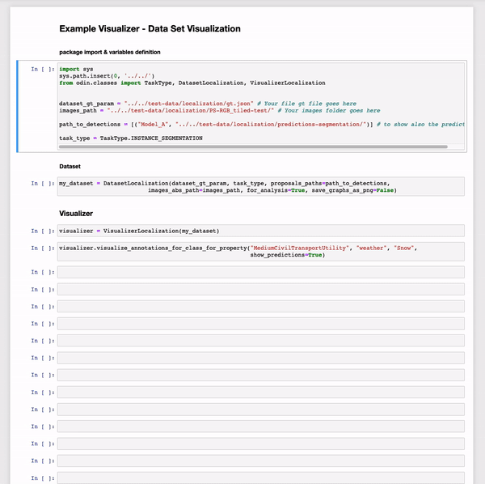

# {{page.title}}
{: .no_toc}

<details open markdown="block">
  <summary>
    Table of contents
  </summary>
  {: .text-delta }
- TOC
{:toc}
</details>

<hr>
**Classification**
{: .text-center}
{:class="img-responsive" style="max-width:800px"}
{: .text-center}
**Localization**
{: .text-center}
{:class="img-responsive" style="max-width:800px"}
{: .text-center}


<hr>

# visualize_annotations()
{: .mb-6}

It shows all the ground truth and, at user request, the related predictions.

#### Parameters
{: .no_toc}
<dl>
  

  <dt><strong>{{ param.name }}</strong></dt>
  <dd><br><b><i>{{ param.type }}</i></b></dd><dd>{{ param.description }}</dd>

  
</dl>

<hr>

### Example
{: .no_toc}
#### Classification
{: .no_toc}
```py
from odin.classes import VisualizerClassification

my_visualizer = VisualizerClassification(models)
my_visualizer.visualize_annotations(show_predictions=True)
```

#### Localization
{: .no_toc}
```py
from odin.classes import VisualizerLocalization

my_visualizer = VisualizerLocalization(models)
my_visualizer.visualize_annotations(show_predictions=True)
```


<hr>

### Tasks supported
{: .no_toc}
<table>
  <thead>
    <tr class="header">
      <th>Binary Classification</th>
      <th>Single-label Classification</th>
      <th>Multi-label Classification</th>
      <th>Object Detection</th>
      <th>Instance Segmentation</th>
    </tr>
  </thead>
  <tbody>
    <tr style="text-align:center;">
      <td style="background:lightgreen;">yes</td>
      <td style="background:lightgreen;">yes</td>
      <td style="background:lightgreen;">yes</td>
      <td style="background:lightgreen;">yes</td>
      <td style="background:lightgreen;">yes</td>
    </tr>
  </tbody>
</table>

<hr>


# visualize_annotations_for_property()
{: .mb-6}

It shows all the ground truth with a specific property value and, at user request, the related predictions.

#### Parameters
{: .no_toc}
<dl>
  

  <dt><strong>{{ param.name }}</strong></dt>
  <dd><br><b><i>{{ param.type }}</i></b></dd><dd>{{ param.description }}</dd>

  
</dl>

<hr>

### Example
{: .no_toc}
#### Classification
{: .no_toc}
```py
from odin.classes import VisualizerClassification

my_visualizer = VisualizerClassification(models)
my_visualizer.visualize_annotations_for_property('property_name',
                                                 'property_value',
                                                 show_predictions=True)
```


#### Localization
{: .no_toc}
```py
from odin.classes import VisualizerLocalization

my_visualizer = VisualizerLocalization(models)
my_visualizer.visualize_annotations_for_property('property_name',
                                                 'property_value',
                                                 show_predictions=True)
```


<hr>

### Tasks supported
{: .no_toc}
<table>
  <thead>
    <tr class="header">
      <th>Binary Classification</th>
      <th>Single-label Classification</th>
      <th>Multi-label Classification</th>
      <th>Object Detection</th>
      <th>Instance Segmentation</th>
    </tr>
  </thead>
  <tbody>
    <tr style="text-align:center;">
      <td style="background:lightgreen;">yes</td>
      <td style="background:lightgreen;">yes</td>
      <td style="background:lightgreen;">yes</td>
      <td style="background:lightgreen;">yes</td>
      <td style="background:lightgreen;">yes</td>
    </tr>
  </tbody>
</table>

<hr>

# visualize_annotations_for_class_for_property()
{: .mb-6}

It shows all the ground truth of a category with a specific property value and, at user request, the related predictions.

#### Parameters
{: .no_toc}
<dl>
  

  <dt><strong>{{ param.name }}</strong></dt>
  <dd><br><b><i>{{ param.type }}</i></b></dd><dd>{{ param.description }}</dd>

  
</dl>

<hr>

### Example
{: .no_toc}
#### Classification
{: .no_toc}
```py
from odin.classes import VisualizerClassification

my_visualizer = VisualizerClassification(models)
my_visualizer.visualize_annotations_for_class_for_property('category_name',
                                                           'property_name',
                                                           'property_value',
                                                           show_predictions=True)
```


#### Localization
{: .no_toc}
```py
from odin.classes import VisualizerLocalization

my_visualizer = VisualizerLocalization(models)
my_visualizer.visualize_annotations_for_class_for_property('category_name',
                                                           'property_name',
                                                           'property_value',
                                                           show_predictions=True)
```


<hr>

### Tasks supported
{: .no_toc}
<table>
  <thead>
    <tr class="header">
      <th>Binary Classification</th>
      <th>Single-label Classification</th>
      <th>Multi-label Classification</th>
      <th>Object Detection</th>
      <th>Instance Segmentation</th>
    </tr>
  </thead>
  <tbody>
    <tr style="text-align:center;">
      <td style="background:lightgreen;">yes</td>
      <td style="background:lightgreen;">yes</td>
      <td style="background:lightgreen;">yes</td>
      <td style="background:lightgreen;">yes</td>
      <td style="background:lightgreen;">yes</td>
    </tr>
  </tbody>
</table>

<hr>
